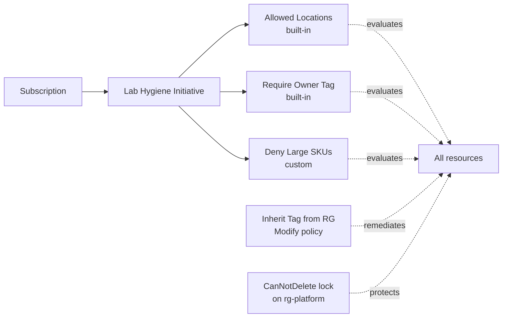

# Module 01 — Governance and cost

The governance layer of the **Secure Azure Administration Environment**. This module installs the controls that every other module assumes: tag enforcement via Azure Policy, an Allowed-Locations policy with a documented sandbox carve-out, resource group locks on shared services, a deny-large-SKU custom policy, an initiative grouping the policies, and Microsoft Cost Management dashboards keyed off the `Module` tag. By the end, the subscription will reject untagged or non-compliant deployments, and per-module spend is visible in a single pinned view.

## What this module demonstrates

| Skill | Where it shows up |
|---|---|
| Azure Policy authoring | Custom JSON policy denying VM SKUs above an approved list |
| Initiative composition | Tag, location, and SKU policies grouped into one initiative |
| Compliance reporting | Pre/post compliance dashboard captures |
| Resource locks | CanNotDelete on platform RG, demonstrated by a denied delete attempt |
| Cost Management | Budgets, alert action group, dashboard pinned by `Module` tag |
| Advisor literacy | All five Advisor categories captured and interpreted |

## Build steps

This module uses **Azure CLI for resource group creation and policy assignment, JSON for custom policy definitions, and Portal for the Cost Management and Advisor screenshots** because those blades produce richer evidence visually than the equivalent CLI output.

### 1. Create the nine resource groups with tags applied at creation

```bash
LOC=eastus
TAGS="Environment=lab Owner=$(whoami) CostCenter=portfolio ExpiryDate=$(date -d '+90 days' +%Y-%m-%d)"

for rg in network-hub platform identity compute storage monitor backup security iac; do
    az group create \
      --name "rg-${rg}-lab-${LOC}-01" \
      --location $LOC \
      --tags $TAGS Module="01-governance-cost"
done

az group list --query "[?tags.Environment=='lab'].[name,tags.Module]" -o table
```

Tags applied at creation are durable. Adding tags later is possible but easy to forget; embedding them into the create call is the discipline.

### 2. Assign the built-in Allowed-Locations policy

```bash
SUB_ID=$(az account show --query id -o tsv)

az policy assignment create \
  --name allowed-locations-eastus \
  --display-name "Lab — Allowed locations: eastus and eastus2" \
  --policy e56962a6-4747-49cd-b67b-bf8b01975c4c \
  --params '{"listOfAllowedLocations":{"value":["eastus","eastus2"]}}' \
  --scope "/subscriptions/$SUB_ID"
```

Verify denial by attempting to create a resource in a non-allowed location:

```bash
az group create --name rg-test-westus --location westus
# Expect: RequestDisallowedByPolicy
```

The denial output is captured to `screenshots/01-policy-denial-westus.png` — the failure is itself the evidence that the policy works.

### 3. Author and assign a custom policy denying large VM SKUs

`scripts/deny-large-sku.policy.json`:

```json
{
  "properties": {
    "displayName": "Lab — Deny VM SKUs above DS2_v2 baseline",
    "policyType": "Custom",
    "mode": "Indexed",
    "parameters": {
      "allowedSkus": {
        "type": "Array",
        "metadata": { "displayName": "Allowed VM SKUs" },
        "defaultValue": ["Standard_B1s", "Standard_B2s", "Standard_DS1_v2", "Standard_DS2_v2"]
      }
    },
    "policyRule": {
      "if": {
        "allOf": [
          { "field": "type", "equals": "Microsoft.Compute/virtualMachines" },
          { "not": { "field": "Microsoft.Compute/virtualMachines/sku.name", "in": "[parameters('allowedSkus')]" } }
        ]
      },
      "then": { "effect": "deny" }
    }
  }
}
```

Create and assign:

```bash
az policy definition create --name deny-large-sku --rules @scripts/deny-large-sku.policy.json
az policy assignment create --name deny-large-sku-sub --policy deny-large-sku --scope "/subscriptions/$SUB_ID"
```

### 4. Build the Lab Hygiene Initiative

Create an initiative grouping the Allowed-Locations policy, the Require-Tag-on-Resources built-in policy (for the `Owner` tag), and the custom deny-large-SKU policy. Assign the initiative at subscription scope. Wait an hour, then capture compliance.

The initiative pattern matters: when this lab moves to production, replacing one policy in an initiative does not require updating every assignment.

### 5. Apply a resource group lock on the platform RG

```bash
az lock create \
  --name protect-platform \
  --resource-group rg-platform-lab-eastus-01 \
  --lock-type CanNotDelete \
  --notes "Protects shared services — Log Analytics workspace and Automation Account"
```

Demonstrate the lock by attempting a delete:

```bash
az group delete --name rg-platform-lab-eastus-01 --yes
# Expect: ScopeLocked
```

Capture the failure to `screenshots/01-lock-blocks-delete.png`.

### 6. Configure the budget action group

Create an action group named `ag-portfolio-email` with email action targeting your address. Wire the existing budget (from module 00) to this action group. The budget alert from module 00 was email-only; this step adds the action-group abstraction so future alerts can fan out to additional channels (Logic App, ITSM connector, webhook).

### 7. Apply tag inheritance via Modify policy

Assign the built-in `Inherit a tag from the resource group` Modify policy. This catches resources that are created without all five required tags by inheriting them from the parent RG. Run a remediation task to backfill any resources created before the policy was assigned. Capture the remediation run completion.

### 8. Open and pin Advisor

Portal → Advisor. Capture each of the five categories: Cost, Reliability, Security, Operational Excellence, Performance. The Cost view is the most relevant in early modules; Security and Operational Excellence become more interesting after modules 06 and 08. Pin Cost to the dashboard.

## Validation

- `az policy state list --resource <any-rg-id> --query "[].{policy:policyDefinitionName,compliance:complianceState}"` returns at least one entry per assigned policy.
- Attempting `az vm create --size Standard_E32s_v3 ...` returns `RequestDisallowedByPolicy` referencing `deny-large-sku`.
- Attempting `az group create --location westus ...` returns `RequestDisallowedByPolicy` referencing `allowed-locations-eastus`.
- `az lock list --resource-group rg-platform-lab-eastus-01` lists `protect-platform`.
- The Lab Hygiene Initiative shows compliance metrics in Policy → Compliance.
- Cost Management → Cost Analysis grouped by `Module` tag shows `01-governance-cost` as the labeled segment for tagged resources.

## Cleanup

Resource groups, policy assignments, locks, and budgets are part of the sustained baseline. Nothing to tear down at the end of this module — they remain in force for every subsequent module and only come down at end-of-portfolio.

**Cost:** $0 spent on this module. Sustained add: $0/month (policies and locks are free).

## Evidence

| File | Demonstrates |
|---|---|
| `screenshots/01-rgs-tagged.png` | Nine resource groups created with all five required tags |
| `screenshots/01-policy-allowed-locations.png` | Allowed-Locations policy assignment at subscription scope |
| `screenshots/01-policy-denial-westus.png` | RequestDisallowedByPolicy error when creating in westus |
| `screenshots/01-policy-deny-large-sku.png` | Custom deny-large-SKU policy definition in the portal |
| `screenshots/01-initiative-compliance.png` | Lab Hygiene Initiative compliance percentages by policy |
| `screenshots/01-rg-lock.png` | CanNotDelete lock on rg-platform |
| `screenshots/01-lock-blocks-delete.png` | ScopeLocked error when attempting to delete the locked RG |
| `screenshots/01-action-group.png` | Budget alert action group configured |
| `screenshots/01-advisor-five-categories.png` | Advisor with Cost/Reliability/Security/OpEx/Performance visible |
| `screenshots/01-cost-by-module-tag.png` | Cost Analysis grouped by the Module tag |
| `scripts/deny-large-sku.policy.json` | Custom policy definition |
| `scripts/initiative-lab-hygiene.json` | Initiative grouping all governance policies |
| `diagrams/01-governance-overview.mmd` | Mermaid: subscription → initiative → three policies → resources |
| `docs/decisions/ADR-0002-tags-vs-rgs.md` | Decision: environment via tags, service domain via RGs |
| `docs/decisions/ADR-0004-deny-large-skus.md` | Decision: custom SKU deny policy with rationale |

### Mermaid diagram embedded



## Resume bullets

- Authored and deployed a custom Azure Policy denying virtual machine SKUs above an approved baseline, paired with a built-in Allowed-Locations policy and a tag-inheritance Modify policy, all grouped into a subscription-scoped initiative.
- Established compliance reporting via the Azure Policy compliance dashboard, demonstrating policy effects with intentional denied deployments captured as evidence.
- Implemented resource group locks (CanNotDelete) protecting shared platform services, validated by a denied delete attempt under role-restricted credentials.
- Configured Microsoft Cost Management with a $100/month budget, three alert thresholds, an action group routing to email, and a per-module cost view pinned to a custom dashboard, achieving sustained spend of $5–10/month against a $100 cap.
- Reviewed Microsoft Advisor across all five categories (Cost, Reliability, Security, Operational Excellence, Performance) and acted on the highest-impact recommendations, documented in module README "lessons learned" sections.

## Interview story

The story for this module is the *intentional denial*. When a hiring manager asks how you prevent shadow IT or accidental cost runaway, the wrong answer is "we have a policy" — the right answer is "we have a policy, and here is the screenshot of the deployment that policy denied." The discipline is treating policy enforcement as a thing you actively prove, not a thing you assume. In this module, an attempt to deploy in `westus` was rejected because the assigned policy says only `eastus` and `eastus2` are allowed; a documented sandbox resource group is excluded from the policy via `--not-scopes`. That single denied deployment demonstrates more about your governance posture than a hundred lines of compliant resources, and it tells the interviewer you understand that policies are only useful when they actually enforce.
