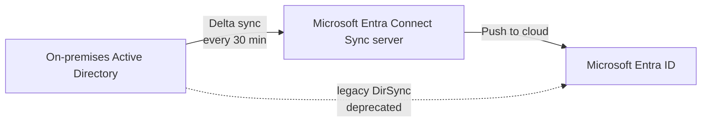
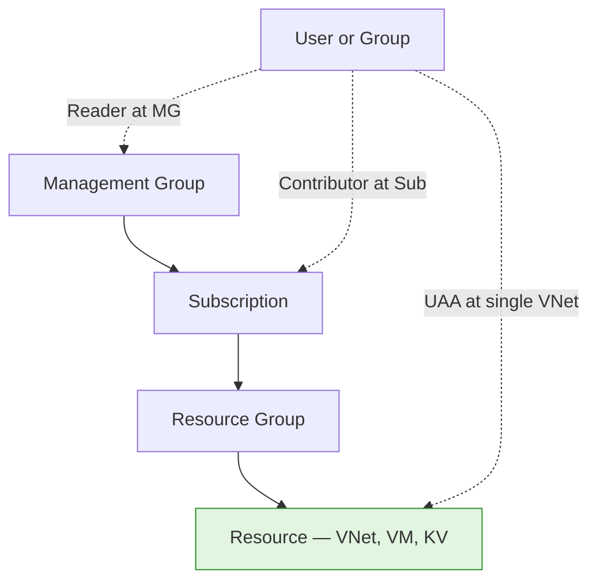

# Module 02 — Identity and RBAC

The identity layer of the **Secure Azure Administration Environment**. This module establishes users, groups, role assignments at the right scope, custom role definitions, Administrative Units for delegated user management, Conditional Access design, hybrid identity design, and the discipline of least-privilege role selection. The themes that recur in interviews — *Contributor cannot assign roles*, *bulk invitation creates guests not members*, *User Access Administrator scoped to a single resource* — are demonstrated end-to-end with both successful operations and intentional denials.

## What this module demonstrates

| Skill | Where it shows up |
|---|---|
| User and group lifecycle | Bulk member creation via Portal, bulk guest invitation via Microsoft Graph PowerShell |
| RBAC at the right scope | Role assignments at subscription, RG, and resource scope, with deliberate trade-offs |
| Custom role authoring | JSON-defined VNet Peering Manager role with multi-scope assignability |
| Administrative Units | Three AUs with scoped User Administrator delegation |
| Conditional Access design | MFA from untrusted locations, hybrid-Entra-joined device requirement |
| Hybrid identity literacy | Microsoft Entra Connect Sync architecture documented (no on-premises AD in lab) |
| Privilege boundary thinking | Demonstrated denials when role lacks the permission |

## Build steps

This module uses **Microsoft Graph PowerShell for bulk operations**, **Azure CLI for RBAC role assignments and custom role definitions**, and **Portal for Conditional Access, Administrative Units, and any Entra blade where the wizard produces clearer evidence than the equivalent CLI**.

The legacy `AzureAD` and `MSOnline` PowerShell modules are end-of-life. Every script in this module uses Microsoft Graph PowerShell (`Microsoft.Graph` module) — the current Microsoft-recommended path for directory operations.

### 1. Create test users (bulk-create wizard, Portal)

Microsoft Entra → Users → Bulk operations → Bulk create. Upload a CSV with `Name`, `User name`, `Initial password`, `Block sign in (Yes/No)` columns. Five test users named `lab-user-01@<tenant>.onmicrosoft.com` through `lab-user-05`.

The bulk-create wizard creates **member** users — accounts in your tenant with full member privileges by default. This is distinct from bulk invitation, which creates guest users. Save the CSV template to `scripts/bulk-create-members-template.csv` so the operation is reproducible.

### 2. Bulk invite guest users (Microsoft Graph PowerShell)

`scripts/bulk-guest-invite.ps1`:

```powershell
Connect-MgGraph -Scopes "User.Invite.All"

$guests = Import-Csv -Path .\scripts\guests-template.csv

foreach ($g in $guests) {
    New-MgInvitation `
        -InvitedUserDisplayName $g.DisplayName `
        -InvitedUserEmailAddress $g.Email `
        -InviteRedirectUrl "https://myapps.microsoft.com" `
        -SendInvitationMessage:$true
    Write-Host "Invited $($g.Email)"
}
```

`New-MgInvitation` is the current cmdlet for guest invitations. It produces guest accounts with the `#EXT#` UPN suffix. The deprecated equivalents (`New-AzureADMSInvitation`, the AzureAD module path) are not used. To distinguish: `New-MgUser` would create a member, while `New-MgInvitation` creates a guest by sending a redemption email.

Use email addresses you control for the invitation test, then redact the addresses in the screenshot before committing.

### 3. Create groups for RBAC

```bash
az ad group create --display-name "sg-vm-admins" --mail-nickname "sg-vm-admins"
az ad group create --display-name "sg-net-admins" --mail-nickname "sg-net-admins"
az ad group create --display-name "sg-readers" --mail-nickname "sg-readers"

# Add a test user to one group
USER_ID=$(az ad user show --id lab-user-01@<tenant>.onmicrosoft.com --query id -o tsv)
az ad group member add --group sg-vm-admins --member-id $USER_ID
```

A Microsoft 365 group is created via the Portal because group-expiration policies only apply to M365 groups, not to security groups. Configure the tenant-level expiration policy at Microsoft Entra → Groups → Expiration → 365 days. This documents the M365-vs-security distinction explicitly: security groups support RBAC and never expire; M365 groups support collaboration features and can expire on a tenant-wide schedule.

### 4. Assign Reader at subscription scope to the readers group

```bash
SUB_ID=$(az account show --query id -o tsv)
GRP_ID=$(az ad group show --group sg-readers --query id -o tsv)

az role assignment create \
  --assignee-object-id $GRP_ID \
  --assignee-principal-type Group \
  --role Reader \
  --scope "/subscriptions/$SUB_ID"
```

### 5. Demonstrate the role-assignment denial

This is the most-tested concept in Azure RBAC and the strongest interview story in the module.

A user with **Contributor** role cannot assign roles to other users — Contributor lacks the `Microsoft.Authorization/roleAssignments/write` permission. The roles that can are **Owner**, **User Access Administrator**, and **Role Based Access Control Administrator**.

Sign in as a user who is Contributor on a resource group only. Attempt `az role assignment create` and capture the failure:

```
AuthorizationFailed: The client '<user>' with object id '<id>' does not have authorization
to perform action 'Microsoft.Authorization/roleAssignments/write' over scope ...
```

Then sign in as yourself, grant **User Access Administrator** scoped to a single VNet (after module 03 creates the VNets) to that test user:

```bash
VNET_ID=$(az network vnet show -g rg-network-hub-lab-eastus-01 -n vnet-hub-lab-eastus-01 --query id -o tsv)
az role assignment create \
  --assignee-object-id $TEST_USER_ID \
  --assignee-principal-type User \
  --role "User Access Administrator" \
  --scope "$VNET_ID"
```

Re-test as the test user. Attempting to assign a role at the VNet scope succeeds; attempting the same operation at the subscription scope still fails. The User Access Administrator permission is bounded by the assignment scope.

The lesson: granting **Owner** for "they need to assign one role" is over-privileged. **User Access Administrator scoped narrowly** is the least-privilege pattern.

### 6. Author a custom role: VNet Peering Manager

`scripts/custom-role-vnet-peering-manager.json`:

```json
{
  "Name": "VNet Peering Manager",
  "Description": "Can create, modify, and delete VNet peerings on the assigned VNets only.",
  "Actions": [
    "Microsoft.Network/virtualNetworks/peerings/read",
    "Microsoft.Network/virtualNetworks/peerings/write",
    "Microsoft.Network/virtualNetworks/peerings/delete",
    "Microsoft.Network/virtualNetworks/read",
    "Microsoft.Network/virtualNetworks/virtualNetworkPeerings/read"
  ],
  "NotActions": [],
  "AssignableScopes": [
    "/subscriptions/<SUB_ID>"
  ]
}
```

```bash
az role definition create --role-definition @scripts/custom-role-vnet-peering-manager.json
az role assignment create \
  --assignee-object-id $USER_ID \
  --role "VNet Peering Manager" \
  --scope "/subscriptions/$SUB_ID/resourceGroups/rg-network-hub-lab-eastus-01"
```

### 7. Create three Administrative Units

```bash
az rest --method POST \
  --uri "https://graph.microsoft.com/v1.0/directory/administrativeUnits" \
  --body '{"displayName":"Office-NA","description":"North America office"}'
# Repeat for Office-EU and Office-APAC
```

Add test users to AUs (Portal → Microsoft Entra → Administrative Units → AU → Users → Add). Then assign **User Administrator** scoped to a single AU. The AU-scoped admin can manage only users within that AU — they do not see users in other AUs and cannot manage tenant-level directory settings.

This is the right answer when an interviewer asks how to delegate user management for one branch office without granting tenant-wide User Administrator.

### 8. Conditional Access — design first, then deploy if licensing permits

Conditional Access requires Microsoft Entra ID P1. Design the policy as a markdown document and Mermaid diagram regardless; deploy it only if a P1 trial is active.

`docs/ca-policy-mfa-untrusted.md`:

| Element | Configuration |
|---|---|
| Policy name | CA001 — MFA for privileged groups from untrusted locations |
| Users | Include: `sg-admins`. Exclude: emergency break-glass account. |
| Conditions | Locations: include All, exclude Trusted (named location: home IP). |
| Grant control | Require multi-factor authentication AND Require Hybrid Microsoft Entra joined device. |
| Session control | Sign-in frequency: 8 hours. |

The grant section is where the per-user MFA toggle (the legacy MFA settings page) is *not* sufficient — that toggle predates Conditional Access and does not scope by location, group, or device state. CA is the modern enforcement path.

If P1 is active, configure named locations first (Microsoft Entra → Security → Conditional Access → Named locations → New location). Add your home IP as Trusted. Then configure the policy itself.

### 9. Hybrid identity — design only

No on-premises Active Directory exists in this lab, so Microsoft Entra Connect Sync is documented but not deployed. The design captures both Connect Sync (full-featured, Windows server installation) and the lighter Cloud Sync (agent-based, fewer features). The synchronization cadence (`Start-ADSyncSyncCycle -PolicyType Delta`) and the deprecation status of the older DirSync tool are noted explicitly.

`diagrams/02-entra-connect-sync.mmd`:



### 10. Other identity-blade demonstrations

These are quick wins that round out the module:

- **Directory roles assignment.** Microsoft Entra → Roles and administrators → User Administrator → Add assignment. Differentiates directory roles (tenant-scoped) from Azure RBAC roles (subscription-scoped).
- **License assignment blade.** User → Licenses → Assign. Even with no licenses to assign, the screenshot shows the blade exists and is distinct from Roles.
- **Device settings.** Microsoft Entra → Devices → Device settings → Additional local administrators on Microsoft Entra joined devices. Adds a test user to the local admin group on Entra-joined devices.
- **External collaboration settings.** Microsoft Entra → External Identities → External collaboration settings → Guest invite settings. Modify to allow User Administrator role to invite (default permits any user, but tightening it is a common security baseline).
- **Custom domain verification.** Add a sample domain and capture the TXT/MX records required for verification. Documents the registrar-level NS delegation pattern that ties into module 03 DNS.

## Validation

- `Get-MgUser -Filter "userType eq 'Member'"` returns the bulk-created members.
- `Get-MgUser -Filter "userType eq 'Guest'"` returns the bulk-invited guests.
- `az role assignment list --assignee $USER_ID --all -o table` shows the User Access Administrator scoped to the VNet only.
- A test user with Contributor on an RG fails to assign a role; the same user with User Access Administrator on a specific resource succeeds for that resource only.
- `az role definition show --name "VNet Peering Manager"` returns the custom role definition.
- An AU-scoped User Administrator can edit users inside their AU but receives "insufficient permissions" for users outside.

## Cleanup

The test users, groups, custom role, and AUs are part of the sustained baseline (zero cost). Delete them only at end-of-portfolio.

If a Microsoft Entra ID P1 trial was activated for the Conditional Access deployment, **cancel the trial within 30 days** to avoid the conversion charge. Microsoft Entra → Licenses → All products → Cancel.

**Cost:** $0 spent on this module. Sustained add: $0/month.

## Evidence

| File | Demonstrates |
|---|---|
| `screenshots/02-bulk-create-members.png` | Five member users created via the bulk-create wizard |
| `screenshots/02-guests-imported.png` | Guest users in the directory after `New-MgInvitation` runs |
| `screenshots/02-groups-created.png` | Three security groups visible in Microsoft Entra |
| `screenshots/02-m365-group-expiration-policy.png` | Tenant-level M365 group expiration policy at 365 days |
| `screenshots/02-contributor-cannot-assign.png` | AuthorizationFailed denial for a Contributor user attempting role assignment |
| `screenshots/02-uaa-scoped-to-vnet.png` | User Access Administrator role scoped to a single VNet |
| `screenshots/02-uaa-grants-reader.png` | The scoped UAA user successfully grants Reader on the VNet |
| `screenshots/02-uaa-cannot-assign-at-sub.png` | Same user denied at subscription scope |
| `screenshots/02-custom-role-applied.png` | VNet Peering Manager custom role definition in the portal |
| `screenshots/02-au-scoped-role.png` | User Administrator assignment scoped to Office-NA AU |
| `screenshots/02-au-admin-limited-view.png` | AU-scoped admin sees only AU members |
| `screenshots/02-ca-grant-control.png` | Conditional Access grant control requiring MFA and hybrid device |
| `screenshots/02-named-locations.png` | Named locations: home IP as Trusted, country range as Untrusted |
| `screenshots/02-directory-role-user-admin.png` | Directory role assignment (User Administrator) |
| `screenshots/02-license-assignment.png` | License assignment blade |
| `screenshots/02-device-settings-local-admin.png` | Device settings with additional local admin configured |
| `screenshots/02-external-collab-settings.png` | External collaboration settings with User Admin invite permission |
| `screenshots/02-custom-domain-verify.png` | Custom domain TXT/MX verification records |
| `scripts/bulk-create-members-template.csv` | Bulk-create CSV template |
| `scripts/bulk-guest-invite.ps1` | Microsoft Graph PowerShell guest invitation script |
| `scripts/guests-template.csv` | Guest invitation CSV template |
| `scripts/custom-role-vnet-peering-manager.json` | Custom role definition |
| `diagrams/02-entra-connect-sync.mmd` | Hybrid identity architecture |
| `diagrams/02-rbac-scopes.mmd` | Role assignment scope hierarchy |
| `docs/ca-policy-mfa-untrusted.md` | CA policy design document |
| `docs/decisions/ADR-0005-uaa-vs-owner.md` | Decision: User Access Administrator scoped narrowly over Owner for delegation |

### Mermaid diagram embedded — RBAC scope hierarchy



## Resume bullets

- Designed and deployed an identity layer for an Azure subscription including security and Microsoft 365 groups, Administrative Unit-scoped delegation, custom RBAC roles, and a Conditional Access policy enforcing multi-factor authentication and hybrid-Entra-joined device requirement for privileged access.
- Authored a custom Azure RBAC role (VNet Peering Manager) granting only the network peering operations required for a delegated team, applying least-privilege at resource scope rather than granting Owner or Contributor.
- Migrated all directory-management automation from the deprecated AzureAD and MSOnline PowerShell modules to Microsoft Graph PowerShell, ensuring forward compatibility with current Microsoft-recommended paths.
- Demonstrated and documented the principle that the Contributor role lacks role-assignment permission, building delegation patterns around User Access Administrator scoped to specific resources rather than broad Owner grants.
- Implemented bulk user creation (Portal wizard, member users) and bulk guest invitation (Microsoft Graph PowerShell, `New-MgInvitation`), distinguishing the two operationally and showing both in evidence with redacted PII.

## Interview story

The interview moment is the *role-assignment denial under Contributor*. When asked to design a delegation pattern — say, a network team that needs to manage VNet peerings without being able to read or modify other resources — the wrong instinct is to grant Contributor at the resource group and call it done. Contributor cannot assign roles, so any operation that requires role assignment (adding a service principal to a peering automation, granting Reader on a peered VNet to a partner) silently fails for that user. The right pattern is two roles: a role that lets them do their actual job (custom VNet Peering Manager), plus User Access Administrator scoped narrowly to the specific resources they need to delegate over. This module demonstrates exactly that pattern with both the failure (`AuthorizationFailed`) and the success captured side-by-side as evidence. The takeaway is that least-privilege is not "give them less" — it is "give them exactly what they need at the right scope," and that requires actually testing both directions.
