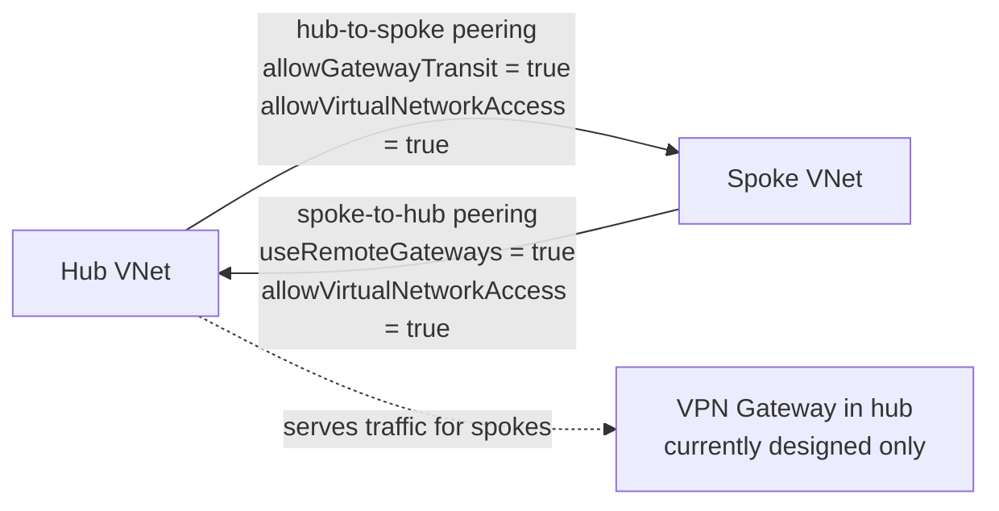

# Module 03 — Networking

The network fabric of the **Secure Azure Administration Environment**. This module delivers a working hub-and-spoke topology, NSGs at subnet scope, Application Security Groups for role-based grouping, NSG rules using service tags (the modern, tenant-aware alternative to IP-range allowlists), public and private DNS zones, an internal Load Balancer with health probes and load-balancing rules demonstrated end-to-end on real backend VMs, Network Watcher diagnostics, and NSG flow logs feeding Traffic Analytics.

## What this module demonstrates

| Skill | Where it shows up |
|---|---|
| Hub-and-spoke topology | Two spokes peered to one hub with gateway-transit flag pair |
| NSG fluency | Subnet-scoped NSGs, explicit deny rules, effective rules inspection |
| ASG modeling | Web/db ASGs allowing rule-by-role rather than rule-by-IP |
| Service tags | NSG rules referencing AzureKeyVault, AzureMonitor, Storage tags |
| DNS | Public DNS zone with NS delegation, private DNS zone linked to VNet |
| Load balancing | Internal LB with TCP health probe and Floating IP load-balancing rule |
| Diagnostics | Network Watcher IP Flow Verify, Connection Troubleshoot, packet capture |
| Observability | NSG flow logs feeding Traffic Analytics in Log Analytics workspace |

## Build steps

This module uses **Azure CLI for VNets, peerings, NSGs, ASGs, and service-tag rules**, **Bicep for the reusable VNet module**, and **Portal for Network Watcher and Traffic Analytics** because those blades are visualization-heavy and produce stronger evidence than CLI output.

### 1. Create the hub VNet

```bash
LOC=eastus
RG_NET=rg-network-hub-lab-eastus-01
TAGS="Environment=lab Owner=$(whoami) CostCenter=portfolio ExpiryDate=$(date -d '+90 days' +%Y-%m-%d) Module=03-networking"

az network vnet create \
  --resource-group $RG_NET \
  --name vnet-hub-lab-eastus-01 \
  --address-prefixes 10.0.0.0/16 \
  --location $LOC \
  --tags $TAGS

# Add reserved subnets
az network vnet subnet create -g $RG_NET --vnet-name vnet-hub-lab-eastus-01 \
  --name snet-shared --address-prefixes 10.0.1.0/24
az network vnet subnet create -g $RG_NET --vnet-name vnet-hub-lab-eastus-01 \
  --name AzureBastionSubnet --address-prefixes 10.0.250.0/26
az network vnet subnet create -g $RG_NET --vnet-name vnet-hub-lab-eastus-01 \
  --name GatewaySubnet --address-prefixes 10.0.255.0/27
```

`AzureBastionSubnet` and `GatewaySubnet` are reserved names — the platform recognizes them and treats them specially. `AzureBastionSubnet` requires a /26 minimum.

### 2. Create the two spoke VNets

```bash
az network vnet create -g $RG_NET -n vnet-spoke-prod-lab-eastus-01 \
  --address-prefixes 10.1.0.0/16 \
  --subnet-name snet-app --subnet-prefixes 10.1.1.0/24 \
  --location $LOC --tags $TAGS

az network vnet create -g $RG_NET -n vnet-spoke-dev-lab-eastus-01 \
  --address-prefixes 10.2.0.0/16 \
  --subnet-name snet-app --subnet-prefixes 10.2.1.0/24 \
  --location $LOC --tags $TAGS

# Add a data subnet to prod
az network vnet subnet create -g $RG_NET --vnet-name vnet-spoke-prod-lab-eastus-01 \
  --name snet-data --address-prefixes 10.1.2.0/24
```

### 3. Peer hub to each spoke with the gateway-transit flag pair

```bash
# Hub side — allow gateway transit, allow VNet access
az network vnet peering create -g $RG_NET -n hub-to-prod \
  --vnet-name vnet-hub-lab-eastus-01 \
  --remote-vnet vnet-spoke-prod-lab-eastus-01 \
  --allow-vnet-access --allow-gateway-transit

# Spoke side — use remote gateways, allow VNet access
az network vnet peering create -g $RG_NET -n prod-to-hub \
  --vnet-name vnet-spoke-prod-lab-eastus-01 \
  --remote-vnet vnet-hub-lab-eastus-01 \
  --allow-vnet-access --use-remote-gateways

# Repeat for the dev spoke
az network vnet peering create -g $RG_NET -n hub-to-dev \
  --vnet-name vnet-hub-lab-eastus-01 \
  --remote-vnet vnet-spoke-dev-lab-eastus-01 \
  --allow-vnet-access --allow-gateway-transit
az network vnet peering create -g $RG_NET -n dev-to-hub \
  --vnet-name vnet-spoke-dev-lab-eastus-01 \
  --remote-vnet vnet-hub-lab-eastus-01 \
  --allow-vnet-access --use-remote-gateways
```

The flag pair matters. `--allow-gateway-transit` on the hub side and `--use-remote-gateways` on the spoke side are the configuration that lets a future VPN Gateway in the hub serve traffic for the spokes. Setting the flags wrong is the single most common peering misconfiguration in the wild — capture both peering definitions in screenshots so the configuration is unambiguously documented.

Spoke-to-spoke traffic does **not** transit the hub by default, even with both flags set. Spokes communicate only when the hub has an Azure Firewall or NVA. This portfolio documents that pattern but does not deploy a Firewall (cost: ~$1.25/hr).

### 4. NSG with explicit allow and deny rules

```bash
az network nsg create -g $RG_NET -n nsg-app-lab-eastus-01 --tags $TAGS

# Allow HTTPS from Internet
az network nsg rule create -g $RG_NET --nsg-name nsg-app-lab-eastus-01 \
  --name allow-https-inbound --priority 100 \
  --direction Inbound --access Allow --protocol Tcp \
  --source-address-prefixes Internet \
  --destination-port-ranges 443

# Explicit deny-all at low priority
az network nsg rule create -g $RG_NET --nsg-name nsg-app-lab-eastus-01 \
  --name deny-all-inbound --priority 4096 \
  --direction Inbound --access Deny --protocol "*" \
  --source-address-prefixes "*" --destination-address-prefixes "*" \
  --destination-port-ranges "*"

# Attach to the prod app subnet
az network vnet subnet update -g $RG_NET \
  --vnet-name vnet-spoke-prod-lab-eastus-01 \
  --name snet-app \
  --network-security-group nsg-app-lab-eastus-01
```

A single NSG attached to a subnet covers every NIC on that subnet. Most lab examples that attach NSGs to individual NICs are over-engineering — subnet-scope is the operational default unless a specific VM has an exception.

### 5. Application Security Groups

```bash
az network asg create -g $RG_NET -n asg-web-lab-eastus-01 --tags $TAGS
az network asg create -g $RG_NET -n asg-db-lab-eastus-01 --tags $TAGS

# Rule: web ASG can reach db ASG on 1433
az network nsg rule create -g $RG_NET --nsg-name nsg-app-lab-eastus-01 \
  --name allow-web-to-db --priority 200 \
  --direction Inbound --access Allow --protocol Tcp \
  --source-asgs asg-web-lab-eastus-01 \
  --destination-asgs asg-db-lab-eastus-01 \
  --destination-port-ranges 1433
```

ASGs replace IP-based source/destination groupings with role-based groupings. When VMs are added to an ASG, the rule applies automatically — no rule update required when scaling.

### 6. NSG rules using service tags

```bash
# Outbound to Azure Key Vault only
az network nsg rule create -g $RG_NET --nsg-name nsg-app-lab-eastus-01 \
  --name allow-outbound-keyvault --priority 200 \
  --direction Outbound --access Allow --protocol Tcp \
  --source-address-prefixes "*" \
  --destination-address-prefixes AzureKeyVault \
  --destination-port-ranges 443

# Outbound to Azure Monitor
az network nsg rule create -g $RG_NET --nsg-name nsg-app-lab-eastus-01 \
  --name allow-outbound-azmon --priority 210 \
  --direction Outbound --access Allow --protocol Tcp \
  --destination-address-prefixes AzureMonitor \
  --destination-port-ranges 443

# Deny everything else outbound to Internet
az network nsg rule create -g $RG_NET --nsg-name nsg-app-lab-eastus-01 \
  --name deny-outbound-internet --priority 4000 \
  --direction Outbound --access Deny --protocol "*" \
  --destination-address-prefixes Internet \
  --destination-port-ranges "*"
```

Service tags are tenant-aware managed groups of IPs maintained by Microsoft. Using `AzureKeyVault` instead of a hardcoded IP range means the rule stays correct when Microsoft adds new Key Vault endpoint IPs. This is the modern pattern; hardcoded IP ranges are anti-pattern.

### 7. DNS — public zone

```bash
DOMAIN=contoso-test-$(openssl rand -hex 3).com

az network dns zone create -g $RG_NET -n $DOMAIN --tags $TAGS
# Capture the assigned NS records — these would be published at the registrar
az network dns record-set ns show -g $RG_NET -z $DOMAIN -n @ \
  --query "nsRecords[].nsdname" -o table
```

The public zone demonstrates DNS delegation: the four NS records returned are what would be configured at a domain registrar to delegate authority to Azure DNS. Capture the NS records to a screenshot — the delegation pattern is the lesson, not the actual ownership of a domain.

### 8. DNS — private zone linked to VNet

```bash
az network private-dns zone create -g $RG_NET -n privatelink.blob.core.windows.net

az network private-dns link vnet create -g $RG_NET \
  --zone-name privatelink.blob.core.windows.net \
  --name link-prod \
  --virtual-network vnet-spoke-prod-lab-eastus-01 \
  --registration-enabled false
```

This zone supports private-endpoint name resolution in module 05 (storage). When a private endpoint is created for a storage account, an A record is added to this zone pointing the storage account FQDN to the private IP.

### 9. Internal Load Balancer with backend VMs (build-and-tear-down)

This is the "build briefly, validate, screenshot, delete" pattern. The internal LB and two backend VMs are deployed for ~2 hours, validated, captured, and deleted within the same session. Cost: ~$0.50/day if torn down promptly.

```bash
RG_C=rg-compute-lab-eastus-01

# Two B1s VMs in the prod app subnet
for i in 01 02; do
  az vm create -g $RG_C -n vm-web-lab-eus-$i --image Ubuntu2404 --size Standard_B1s \
    --vnet-name vnet-spoke-prod-lab-eastus-01 --subnet snet-app \
    --admin-username azureuser --generate-ssh-keys \
    --custom-data <(echo '#!/bin/bash
apt-get update && apt-get install -y nginx
echo "vm-web-lab-eus-'"$i"'" > /var/www/html/index.html') \
    --tags $TAGS
done

# Internal Load Balancer (Standard SKU)
az network lb create -g $RG_NET -n ilb-app-lab-eastus-01 \
  --sku Standard --vnet-name vnet-spoke-prod-lab-eastus-01 --subnet snet-app \
  --frontend-ip-name fip-app --backend-pool-name bep-app --location $LOC --tags $TAGS

# TCP health probe on port 80
az network lb probe create -g $RG_NET --lb-name ilb-app-lab-eastus-01 \
  --name probe-http --protocol Tcp --port 80

# Load-balancing rule with Floating IP
az network lb rule create -g $RG_NET --lb-name ilb-app-lab-eastus-01 \
  --name lbr-http --protocol Tcp \
  --frontend-port 80 --backend-port 80 \
  --frontend-ip-name fip-app --backend-pool-name bep-app \
  --probe-name probe-http --floating-ip true

# Add NICs to backend pool
for i in 01 02; do
  NIC_ID=$(az vm show -g $RG_C -n vm-web-lab-eus-$i --query 'networkProfile.networkInterfaces[0].id' -o tsv)
  IP_NAME=$(az network nic show --ids $NIC_ID --query 'ipConfigurations[0].name' -o tsv)
  az network nic ip-config address-pool add --nic-name $(basename $NIC_ID) \
    --ip-config-name $IP_NAME --resource-group $RG_C \
    --lb-name ilb-app-lab-eastus-01 --address-pool bep-app
done
```

Validate by SSHing to a third VM in the same VNet and curl-ing the LB front-end IP repeatedly:

```bash
for i in {1..10}; do curl http://10.1.1.4; done
# Expect alternating responses: vm-web-lab-eus-01 / vm-web-lab-eus-02
```

The TCP probe and Floating IP combination is the canonical pattern for fronting clustered services like SQL Always On listeners — even though this lab uses simple nginx backends, the configuration mirrors the production pattern.

**Cleanup immediately after evidence capture:**

```bash
az network lb delete -g $RG_NET -n ilb-app-lab-eastus-01
for i in 01 02; do
  az vm delete -g $RG_C -n vm-web-lab-eus-$i --yes
done
# Sweep orphans
az disk list -g $RG_C --query "[?managedBy==null].id" -o tsv | xargs -r -n1 az disk delete --yes --ids
az network nic list -g $RG_C --query "[?virtualMachine==null].id" -o tsv | xargs -r -n1 az network nic delete --ids
```

### 10. Network Watcher diagnostics

Network Watcher is auto-enabled per region. Use it for IP Flow Verify (does my NSG allow this connection?), Connection Troubleshoot (end-to-end path test), and short packet capture sessions. Capture the IP Flow Verify output for an allowed connection and a denied connection — the side-by-side is the strongest evidence.

### 11. NSG flow logs and Traffic Analytics

Network Watcher → NSG flow logs → Create. Target the NSG, point at a storage account (created in module 05), enable version 2, enable Traffic Analytics, point at the Log Analytics workspace from module 06. Wait 30 minutes for data to populate. Capture a Traffic Analytics geo-map.

The role requirements matter: Traffic Analytics needs **Owner** at subscription scope, OR **Network Contributor** plus **Log Analytics Contributor** at workspace scope. Reader fails. This is documented in `docs/decisions/ADR-traffic-analytics-roles.md`.

After evidence capture, **disable the flow logs** — they ingest continuously and can blow through the LA daily cap.

### 12. Bastion (build-and-tear-down)

For the SSH-via-browser screenshot, deploy Bastion at the start of a session, connect to a VM, capture the browser session, delete Bastion before logging off. Commands and cost guard in [`../cost-and-cleanup.md`](../cost-and-cleanup.md).

### 13. Design-only documentation

The following are documented with diagrams and configuration walkthroughs but not deployed:

- **Application Gateway v2 with WAF** — `diagrams/03-app-gateway-design.mmd` and a configuration walkthrough.
- **VPN Gateway P2S** — `diagrams/03-p2s-vpn.mmd`. A brief deployment is acceptable if cost and time permit.
- **Azure Firewall** — `diagrams/03-azure-firewall-design.mmd`. Cost alone makes design-only the right choice.
- **Front Door, Traffic Manager** — design notes describing routing methods and decision criteria.

## Validation

- Both peering definitions for hub↔prod show the correct flag pair: hub side `allowGatewayTransit=true`, spoke side `useRemoteGateways=true`.
- `az network nsg rule list -g $RG_NET --nsg-name nsg-app-lab-eastus-01 -o table` shows both allow and explicit-deny rules at the expected priorities.
- The service-tag rule for AzureKeyVault appears with the resolved tag, not a hardcoded IP range.
- The internal LB front-end IP responds round-robin across the two backend VMs during validation.
- `az network watcher test-ip-flow` returns `Allow` for an allowed flow and `Deny` for a flow blocked by the explicit deny rule.

## Cleanup

The VNets, subnets, NSGs, ASGs, peerings, and DNS zones are part of the sustained baseline. The internal LB, backend VMs, NSG flow logs, and Bastion are torn down within their respective sessions. The public DNS zone has a small monthly cost (~$0.50/zone/month) — delete it after evidence capture if you do not plan to revisit DNS demonstrations.

**Cost:** ~$2–4 spent on this module (LB + 2 VMs for one session). Sustained add: ~$0.50/month if public DNS zone retained.

## Evidence

| File | Demonstrates |
|---|---|
| `screenshots/03-vnet-hub-with-subnets.png` | Hub VNet with three subnets including reserved names |
| `screenshots/03-peering-hub-prod-flags.png` | Hub-side peering with allow-gateway-transit |
| `screenshots/03-peering-prod-hub-flags.png` | Spoke-side peering with use-remote-gateways |
| `screenshots/03-nsg-rules-table.png` | NSG with allow-https, allow-web-to-db, deny-all rules |
| `screenshots/03-nsg-service-tag-keyvault.png` | NSG rule with destination service tag AzureKeyVault |
| `screenshots/03-asg-rule.png` | NSG rule using web and db ASGs as source/destination |
| `screenshots/03-effective-rules.png` | Effective security rules on a VM NIC |
| `screenshots/03-public-dns-ns-records.png` | Public DNS zone with four NS records assigned by Azure |
| `screenshots/03-private-dns-zone-linked.png` | Private DNS zone linked to the prod VNet |
| `screenshots/03-ilb-front-end-config.png` | Internal LB with front-end IP, backend pool, and probe |
| `screenshots/03-ilb-load-balancing-rule.png` | Load-balancing rule with Floating IP enabled |
| `screenshots/03-ilb-curl-roundrobin.png` | Curl output alternating between backend VMs |
| `screenshots/03-network-watcher-ip-flow-allow.png` | IP Flow Verify returning Allow |
| `screenshots/03-network-watcher-ip-flow-deny.png` | IP Flow Verify returning Deny |
| `screenshots/03-traffic-analytics-geomap.png` | Traffic Analytics geo-map of NSG flow data |
| `screenshots/03-bastion-session.png` | Browser-based SSH session through Bastion |
| `scripts/modules/vnet.bicep` | Reusable VNet Bicep module |
| `scripts/modules/nsg.bicep` | Reusable NSG Bicep module |
| `diagrams/03-hub-spoke-gateway-transit.mmd` | Topology with peering flags annotated |
| `diagrams/03-ilb-sql-listener.mmd` | ILB pattern fronting clustered backend with TCP probe + Floating IP |
| `diagrams/03-app-gateway-design.mmd` | App Gateway v2 with WAF and path-based routing |
| `diagrams/03-azure-firewall-design.mmd` | Firewall in hub centralizing spoke egress |
| `docs/decisions/ADR-0006-hub-spoke.md` | Decision: hub-and-spoke vs flat |

### Mermaid diagram embedded — peering flag pair



## Resume bullets

- Designed and deployed a hub-and-spoke virtual network topology spanning a hub VNet and two workload spokes, with bidirectional peering configured using `allow-gateway-transit` and `use-remote-gateways` flag pairs to support centralized gateway placement.
- Implemented Network Security Groups at subnet scope with explicit deny-all rules, layered Application Security Groups for role-based traffic policy, and service-tag rules referencing Microsoft-maintained tag groups (AzureKeyVault, AzureMonitor, Storage) for tenant-aware allowlisting.
- Deployed and validated an internal Standard Load Balancer with TCP health probes and Floating IP load-balancing rules, demonstrating round-robin distribution across two nginx backends and capturing the configuration pattern used for clustered services like SQL Always On listeners.
- Operationalized network observability with Network Watcher diagnostics (IP Flow Verify, Connection Troubleshoot, packet capture) and NSG flow logs feeding Traffic Analytics in a centralized Log Analytics workspace.
- Authored Bicep modules for VNet, subnet, and NSG resources usable across spoke deployments, parameterized for address space and tag inheritance.

## Interview story

The story is the *peering flag pair*. When asked to design connectivity between an on-premises network and multiple Azure workloads, junior engineers reach for VNet-to-VNet VPNs or full-mesh peering. The interview-grade answer is a hub VNet with a single VPN or ExpressRoute gateway, peered to spoke VNets with `allowGatewayTransit` on the hub side and `useRemoteGateways` on the spoke side. The flags are the entire design — set them wrong and the spokes cannot reach on-premises through the hub gateway, which is the whole point of the topology. This module captures both peering definitions in screenshots so the reviewer can verify the flags directly. The lesson is broader: in Azure networking, the configuration of two flags on two peerings determines whether an entire architecture works or silently fails. Knowing which flags and on which side is the difference between someone who has read the documentation and someone who has actually built and operated the topology.
