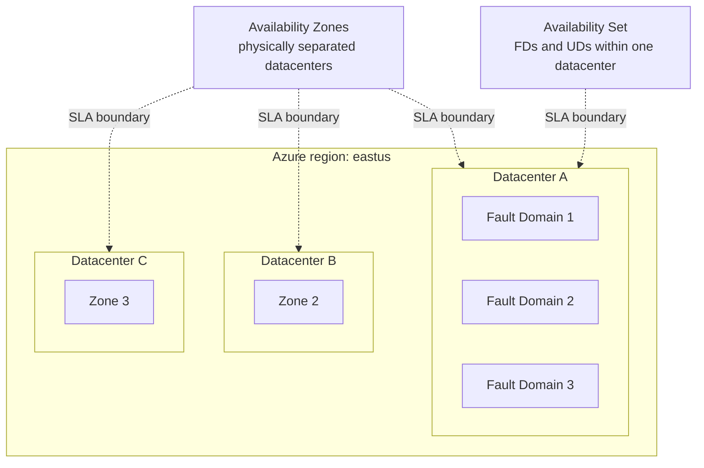

# Module 04 — Compute

The compute layer of the **Secure Azure Administration Environment**. This module delivers Linux and Windows VMs, an Availability Set demonstrating fault and update domain limits, a Virtual Machine Scale Set with autoscale rules triggered by real CPU load, managed disk lifecycle operations (attach, detach, snapshot, move between VMs without stopping), VM extensions including the Azure Monitor Agent and Custom Script Extension, image creation from a generalized VM, and Just-in-Time VM access through Microsoft Defender for Cloud. Cloud-init delivers a pre-trusted CA certificate at first boot.

## What this module demonstrates

| Skill | Where it shows up |
|---|---|
| VM provisioning at scale | Single VMs, Availability Sets, Scale Sets, Spot pricing tier |
| High availability primitives | Fault and update domain limits, comparison with Availability Zones |
| Disk lifecycle | Detach-move-reattach without stopping the VM, snapshot creation |
| Bootstrapping | cloud-init for Linux, Custom Script Extension for both, Run Command for ad-hoc |
| Cost tier choices | Spot VMs, Reserved Instance design, Hybrid Benefit awareness |
| JIT VM access | Defender for Cloud-managed time-bounded NSG opens for SSH/RDP |
| Image lifecycle | Generalized VM → managed image, with reference to VM Image Builder |

## Build steps

This module uses **Azure CLI for provisioning, cloud-init for Linux bootstrap, Bicep for the AvSet template**, and **Portal for JIT and VMSS autoscale screenshots** because those visualizations are richer than CLI output.

### 1. Create an Availability Set with maximum FD and UD

```bash
RG_C=rg-compute-lab-eastus-01
LOC=eastus
TAGS="Environment=lab Owner=$(whoami) CostCenter=portfolio ExpiryDate=$(date -d '+90 days' +%Y-%m-%d) Module=04-compute"

az vm availability-set create \
  --resource-group $RG_C \
  --name avset-app-lab-eastus-01 \
  --platform-fault-domain-count 3 \
  --platform-update-domain-count 20 \
  --tags $TAGS
```

The platform's region-by-region maximums are 3 fault domains (a small handful of regions support more) and 20 update domains. Demonstrating the upper bounds is the point — and capturing the validation error when attempting `--platform-fault-domain-count 10` is equally good evidence that you understand the constraint.

```bash
# Intentional-failure capture
az vm availability-set create -g $RG_C -n avset-fail \
  --platform-fault-domain-count 10 --platform-update-domain-count 30 || true
# Expect: "InvalidParameter" referencing the FD/UD limits
```

### 2. Place two VMs into the Availability Set

```bash
for i in 01 02; do
  az vm create -g $RG_C -n vm-app-lab-eus-$i \
    --image Ubuntu2404 --size Standard_B1s \
    --availability-set avset-app-lab-eastus-01 \
    --vnet-name vnet-spoke-prod-lab-eastus-01 --subnet snet-app \
    --admin-username azureuser --generate-ssh-keys \
    --tags $TAGS
done
```

Document the resize trap: changing one AvSet member to a SKU that the underlying cluster does not support requires deallocating **all** members first. The Portal's resize dialog states this explicitly when relevant; capture that error message as evidence.

### 3. Compare with Availability Zones

Deploy a third VM into Availability Zone 1 to contrast the two patterns:

```bash
az vm create -g $RG_C -n vm-zoned-lab-eus-01 \
  --image Ubuntu2404 --size Standard_B1s --zone 1 \
  --vnet-name vnet-spoke-prod-lab-eastus-01 --subnet snet-app \
  --admin-username azureuser --generate-ssh-keys --tags $TAGS
```

Availability Sets give a single-data-center HA boundary (FDs and UDs are within one datacenter); Availability Zones give a regional HA boundary across physically separated datacenters. The decision rationale is captured in `docs/decisions/ADR-0007-avset-vs-zones.md`. Modern designs default to Zones for new workloads.

### 4. cloud-init for first-boot configuration

`scripts/cloud-init-ca-trust.yaml`:

```yaml
#cloud-config
package_update: true
package_upgrade: false
packages:
  - ca-certificates

write_files:
  - path: /usr/local/share/ca-certificates/contoso-internal-ca.crt
    permissions: '0644'
    content: |
      -----BEGIN CERTIFICATE-----
      <self-signed test cert content>
      -----END CERTIFICATE-----

runcmd:
  - update-ca-certificates
  - logger "cloud-init CA trust applied at first boot"
```

```bash
az vm create -g $RG_C -n vm-cert-lab-eus-01 \
  --image Ubuntu2404 --size Standard_B1s \
  --vnet-name vnet-spoke-prod-lab-eastus-01 --subnet snet-app \
  --admin-username azureuser --generate-ssh-keys \
  --custom-data @scripts/cloud-init-ca-trust.yaml --tags $TAGS
```

After boot, SSH in and validate:

```bash
ls /usr/local/share/ca-certificates/contoso-internal-ca.crt
update-ca-certificates --fresh | grep contoso
```

cloud-init runs once at first boot; subsequent boots skip the configuration. This is the right tool for image-time customization that should be idempotent across the VM's lifetime. For ongoing configuration management, the Custom Script Extension or Azure Automation State Configuration are better choices.

### 5. Managed disk operations

```bash
# Create a 32 GiB Standard HDD data disk
az disk create -g $RG_C -n disk-data-app-01 \
  --size-gb 32 --sku Standard_LRS --tags $TAGS

# Attach to vm-app-lab-eus-01
az vm disk attach -g $RG_C --vm-name vm-app-lab-eus-01 --name disk-data-app-01

# SSH in and format/mount
ssh azureuser@$(az vm show -g $RG_C -n vm-app-lab-eus-01 -d --query publicIps -o tsv) <<'EOF'
sudo parted /dev/sdc --script mklabel gpt mkpart primary ext4 0% 100%
sudo mkfs.ext4 /dev/sdc1
sudo mkdir -p /mnt/data
sudo mount /dev/sdc1 /mnt/data
echo '/dev/sdc1 /mnt/data ext4 defaults,nofail 0 2' | sudo tee -a /etc/fstab
EOF
```

Now move the disk to the second VM **without stopping either VM** — the operation requires only an `umount` inside the source OS:

```bash
# Inside vm-app-lab-eus-01:
sudo umount /mnt/data

# From your workstation:
az vm disk detach -g $RG_C --vm-name vm-app-lab-eus-01 --name disk-data-app-01
az vm disk attach -g $RG_C --vm-name vm-app-lab-eus-02 --name disk-data-app-01

# SSH into vm-app-lab-eus-02 and remount
ssh azureuser@$(az vm show -g $RG_C -n vm-app-lab-eus-02 -d --query publicIps -o tsv) \
  "sudo mkdir -p /mnt/data && sudo mount /dev/sdc1 /mnt/data && ls /mnt/data"
```

Stopping the VM is **not** required for managed disk detach/attach. The common misconception is "stop the VM first" — that step is unnecessary at the platform level and the operation completes faster without it. Document this explicitly because the wrong instinct gets demonstrated in older training material.

### 6. Snapshot a managed disk

```bash
DISK_ID=$(az disk show -g $RG_C -n disk-data-app-01 --query id -o tsv)
az snapshot create -g $RG_C -n snap-disk-data-app-01-$(date +%Y%m%d) \
  --source $DISK_ID --tags $TAGS
```

Snapshots are point-in-time copies, billed per GiB used. They are appropriate for short-term recovery and image creation. For scheduled, retention-managed backups, the Recovery Services Vault in module 07 is the right tool.

### 7. Generalize a VM and create a managed image

```bash
# Inside vm-app-lab-eus-01 — deprovision the agent
sudo waagent -deprovision+user -force
exit

# Deallocate and generalize
az vm deallocate -g $RG_C -n vm-app-lab-eus-01
az vm generalize -g $RG_C -n vm-app-lab-eus-01

# Capture as managed image
az image create -g $RG_C -n img-app-baseline-2026-05 \
  --source vm-app-lab-eus-01 --tags $TAGS
```

A generalized VM cannot be restarted; only specialized snapshots can. The image is then usable as the source for new VM creation. For a multi-image, multi-region, governed image pipeline, **VM Image Builder** is the modern Microsoft path — documented in `docs/vm-image-builder-design.md`.

The legacy `Add-AzVhd` command for uploading a VHD is documented as the historical entry point but not used here, since modern flows go through generalized VMs and Image Builder rather than VHD upload.

### 8. VMSS with autoscale (build-and-tear-down)

```bash
az vmss create -g $RG_C -n vmss-web-lab-eastus-01 \
  --image Ubuntu2404 --instance-count 2 --vm-sku Standard_B1s \
  --vnet-name vnet-spoke-prod-lab-eastus-01 --subnet snet-app \
  --admin-username azureuser --generate-ssh-keys --tags $TAGS

# Autoscale rule: CPU > 70% for 5 min → +1 instance, max 4
az monitor autoscale create -g $RG_C \
  --resource $(az vmss show -g $RG_C -n vmss-web-lab-eastus-01 --query id -o tsv) \
  --min-count 2 --max-count 4 --count 2 \
  --name autoscale-vmss-web

az monitor autoscale rule create -g $RG_C \
  --autoscale-name autoscale-vmss-web --condition "Percentage CPU > 70 avg 5m" \
  --scale out 1
```

Trigger autoscale by stressing CPU on one instance:

```bash
INSTANCE_IP=$(az vmss list-instance-public-ips -g $RG_C -n vmss-web-lab-eastus-01 --query "[0].ipAddress" -o tsv)
ssh azureuser@$INSTANCE_IP 'sudo apt-get install -y stress && stress --cpu 1 --timeout 600 &'
# Watch instance count climb
watch "az vmss show -g $RG_C -n vmss-web-lab-eastus-01 --query 'sku.capacity'"
```

After capturing scale-out evidence, **delete the VMSS**:

```bash
az vmss delete -g $RG_C -n vmss-web-lab-eastus-01
```

### 9. Just-in-Time VM access

JIT requires Microsoft Defender for Servers Plan 1 — enable the free trial. Portal navigation: Microsoft Defender for Cloud → Workload protections → Just-in-time VM access → Configure for `vm-app-lab-eus-01`. Configure SSH (22) with a 3-hour maximum and per-request approval.

Test the workflow: request access, confirm the NSG temporarily opens 22 only to your source IP, SSH in, observe that the NSG hole closes after the configured time. Capture the request, the temporary NSG rule, and the timeout.

After capturing evidence, **disable Defender for Servers** to avoid the conversion charge:

```bash
az security pricing create -n VirtualMachines --tier Free
```

### 10. Spot VM for cost optimization

```bash
az vm create -g $RG_C -n vm-spot-lab-eus-01 \
  --image Ubuntu2404 --size Standard_B2s \
  --priority Spot --max-price 0.005 --eviction-policy Deallocate \
  --vnet-name vnet-spoke-prod-lab-eastus-01 --subnet snet-app \
  --admin-username azureuser --generate-ssh-keys --tags $TAGS

# Tear down same day
az vm delete -g $RG_C -n vm-spot-lab-eus-01 --yes
```

Spot is the right cost tier for batch workloads and CI/CD agents that tolerate eviction. The `--max-price` cap protects against price spikes; `--eviction-policy Deallocate` keeps the disk so the VM can resume when capacity returns.

### 11. VM extensions

The Azure Monitor Agent (AMA) replaces the older Log Analytics agent. Install via Data Collection Rule from module 06 — this module captures the AMA installation result, while the DCR association lives in the monitoring module.

The Custom Script Extension installs nginx for ad-hoc demonstrations:

```bash
az vm extension set -g $RG_C --vm-name vm-app-lab-eus-02 \
  --name CustomScript --publisher Microsoft.Azure.Extensions --version 2.1 \
  --settings '{"commandToExecute":"apt-get update && apt-get install -y nginx"}'
```

Run Command executes one-off scripts without an extension lifecycle:

```bash
az vm run-command invoke -g $RG_C -n vm-app-lab-eus-02 \
  --command-id RunShellScript --scripts "uptime && df -h"
```

## Validation

- `az vm availability-set show -g $RG_C -n avset-app-lab-eastus-01 --query "[platformFaultDomainCount,platformUpdateDomainCount]"` returns `[3, 20]`.
- The intentional FD=10 creation attempt fails with `InvalidParameter`.
- Detaching a managed data disk and reattaching to a second VM completes without either VM being stopped.
- VMSS scale-out is observable: instance count rises after the stress test and falls after CPU returns to baseline.
- A JIT request opens an NSG rule allowing SSH from your source IP only; the rule disappears after the configured timeout.
- The generalized image is visible in `az image list` and can be used as the source for new VM creation.

## Cleanup

VMs, VMSS, JIT configuration, and Spot VMs are torn down at the end of each session. The Availability Set itself is free; either keep it for future demonstrations or delete with `az vm availability-set delete`. The managed image is small (~$0.05/month) — keep or delete based on whether you plan to revisit image-based deployments.

```bash
# Standard end-of-session sweep for module 04
az vm list -g $RG_C -o table
az vm delete --ids $(az vm list -g $RG_C --query "[].id" -o tsv) --yes 2>/dev/null
az disk list -g $RG_C --query "[?managedBy==null].id" -o tsv | xargs -r -n1 az disk delete --yes --ids
az network nic list -g $RG_C --query "[?virtualMachine==null].id" -o tsv | xargs -r -n1 az network nic delete --ids
az network public-ip list -g $RG_C --query "[?ipConfiguration==null].id" -o tsv | xargs -r -n1 az network public-ip delete --ids

# Defender for Servers back to Free if a trial was used
az security pricing create -n VirtualMachines --tier Free
```

**Cost:** ~$3–6 spent on this module across multiple sessions. Sustained add: <$1/month if image retained.

## Evidence

| File | Demonstrates |
|---|---|
| `screenshots/04-avset-fd3-ud20.png` | Availability Set with FD=3, UD=20 |
| `screenshots/04-avset-fd10-error.png` | Validation error attempting FD=10 |
| `screenshots/04-avset-resize-error.png` | Resize blocked when other AvSet members are running |
| `screenshots/04-vm-zoned.png` | VM in Availability Zone 1 |
| `screenshots/04-vm-trusted-ca-verified.png` | cloud-init CA trust validated inside the OS |
| `screenshots/04-disk-detach-attach-success.png` | Disk move from VM A to VM B with no VM stopped |
| `screenshots/04-disk-snapshot.png` | Managed disk snapshot in the portal |
| `screenshots/04-image-created.png` | Managed image visible in the Images blade |
| `screenshots/04-vmss-scaled-out.png` | VMSS instance count after autoscale-out triggered |
| `screenshots/04-jit-request-allowed.png` | JIT request approved with temporary NSG rule visible |
| `screenshots/04-jit-rule-expired.png` | NSG rule absent after JIT timeout |
| `screenshots/04-spot-vm-config.png` | Spot VM with max-price and eviction policy |
| `screenshots/04-run-command.png` | Run Command output |
| `screenshots/04-custom-script-extension.png` | Custom Script Extension execution result |
| `scripts/cloud-init-ca-trust.yaml` | cloud-init for first-boot CA trust |
| `scripts/avset.bicep` | Reusable Bicep for AvSet creation |
| `scripts/mount-data-disk.sh` | Disk mount automation |
| `diagrams/04-avset-vs-zones.mmd` | AvSet single-DC vs Zones cross-DC HA boundaries |
| `diagrams/04-vm-extension-stack.mmd` | AMA, Custom Script, Run Command, JIT |
| `docs/decisions/ADR-0007-avset-vs-zones.md` | Decision: Zones for new workloads |
| `docs/vm-image-builder-design.md` | Modern image pipeline using VM Image Builder |

### Mermaid diagram embedded — AvSet vs Zones



## Resume bullets

- Operationalized Azure VM workloads across Availability Sets (3 fault domains, 20 update domains) and Availability Zones, with a documented decision favoring Zones for new workloads while supporting AvSet placement for legacy continuity.
- Managed disk lifecycle including detach-and-reattach across VMs without stopping either machine, snapshot creation for point-in-time recovery, and managed image generation from generalized VMs as input to a VM Image Builder pipeline design.
- Built and validated a Virtual Machine Scale Set with autoscale rules triggered on CPU thresholds, demonstrated end-to-end with a CPU stress test producing observable scale-out and scale-in.
- Implemented Just-in-Time VM access through Microsoft Defender for Cloud, replacing always-open management ports with time-bounded, IP-scoped, approval-gated NSG rules.
- Delivered VM bootstrapping via cloud-init for Linux with a pre-trusted CA certificate at first boot, complemented by Custom Script Extension and Run Command for ongoing configuration tasks.

## Interview story

The story is *moving a managed disk between VMs without stopping either of them*. When asked how to migrate data from one VM to another in Azure, the lazy answer is "snapshot, copy, attach to new VM." The operationally correct answer is to detach the data disk from the source VM (after `umount` inside the OS) and attach it to the destination VM — no VM stop, no copy, no downtime on the destination's other workloads. The misconception that the source VM must be stopped or deallocated comes from outdated documentation and from confusion with OS-disk operations, where deallocation is required for resize. For a data disk, detach-attach is a metadata operation at the platform level. This module captures the timed sequence — detach at T+0, attach at T+15 seconds, mounted on the destination at T+30 seconds, both VMs running throughout. The lesson for the interviewer is that knowing what *isn't* required is as valuable as knowing what is: applying unnecessary downtime is a junior pattern, and avoiding it is what platform engineering looks like in practice.
