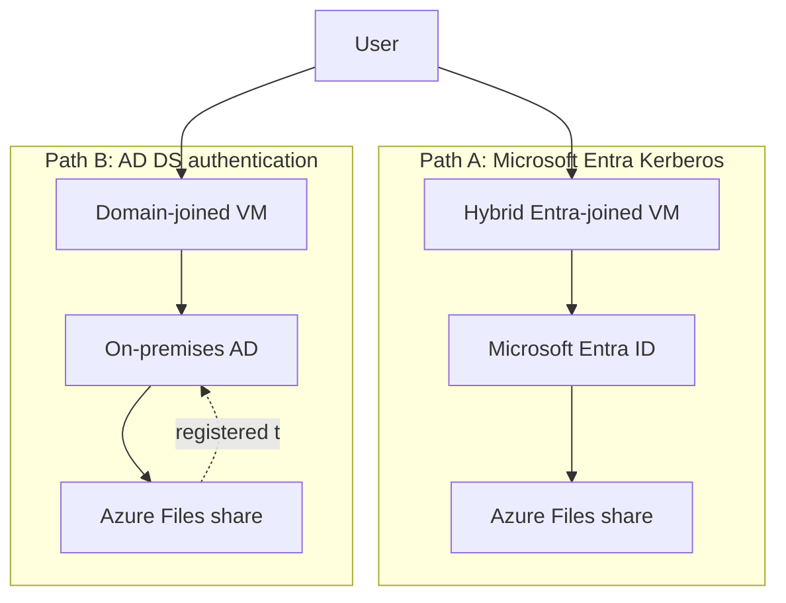

# Module 05 — Storage

The data layer of the **Secure Azure Administration Environment**. This module delivers a hardened storage account: TLS 1.2 minimum, secure transfer required, public network access disabled, shared key access disabled in favor of Microsoft Entra ID authentication. A blob container with versioning, soft delete, lifecycle policy, and an immutability policy. A private endpoint with corresponding private DNS A records. An Azure Files share with identity-based authentication design covering both Microsoft Entra Kerberos and on-premises Active Directory paths. AzCopy for performance-conscious data transfer.

## What this module demonstrates

| Skill | Where it shows up |
|---|---|
| Storage account hardening | TLS, public access, shared key disable, RBAC over keys |
| Network controls | Storage firewall, private endpoint with private DNS integration |
| Data protection | Versioning, soft delete, immutability, lifecycle tier transitions |
| Authentication models | User-delegation SAS, Storage Blob Data Reader/Contributor RBAC, AD DS auth design |
| Cost optimization | Lifecycle: hot → cool → archive → delete on age thresholds |
| Files identity auth | AD DS authentication path AND Microsoft Entra Kerberos path documented |
| Cost export | Daily Cost Management export to a managed container |

## Build steps

This module uses **Azure CLI for storage account configuration and lifecycle policy**, **Bicep for the storage module template**, **AzCopy for transfer benchmarking**, and **Portal for private endpoint creation** because the Portal's wizard handles private DNS integration cleanly in one step.

### 1. Create the storage account with hardened defaults

```bash
RG_S=rg-storage-lab-eastus-01
LOC=eastus
TAGS="Environment=lab Owner=$(whoami) CostCenter=portfolio ExpiryDate=$(date -d '+90 days' +%Y-%m-%d) Module=05-storage"
SA_NAME="stportfoliolabeus$(openssl rand -hex 2)"

az storage account create \
  --resource-group $RG_S \
  --name $SA_NAME \
  --location $LOC \
  --sku Standard_LRS \
  --kind StorageV2 \
  --access-tier Hot \
  --min-tls-version TLS1_2 \
  --https-only true \
  --allow-blob-public-access false \
  --allow-shared-key-access false \
  --public-network-access Disabled \
  --tags $TAGS

echo $SA_NAME > /tmp/sa.name
```

Six hardening settings on creation:

- **TLS 1.2 minimum** — TLS 1.0 and 1.1 are disabled.
- **Secure transfer required** (`--https-only`) — HTTP requests are rejected.
- **Public blob access disabled** — anonymous-read containers cannot be created.
- **Shared key access disabled** — neither the access key nor SAS-from-key works; only Entra ID authentication is accepted.
- **Public network access disabled** — only private endpoints and explicit firewall allows can reach the account.
- Default **LRS** redundancy is sufficient for the lab; the redundancy decision matrix (LRS, ZRS, GRS, GZRS, RA-GZRS) is in `docs/redundancy-cheatsheet.md`.

The `--allow-shared-key-access false` setting is the most important one for security posture. With shared keys enabled, anyone with the key effectively has full data-plane access; rotation is the only mitigation. Disabling shared key access forces every operation through Microsoft Entra ID, where access is governed by RBAC and revocable per-identity. This is the modern Microsoft-recommended baseline.

### 2. Grant yourself Storage Blob Data Contributor

Because shared key access is disabled, even your own admin account needs an Entra ID role to read or write blobs:

```bash
SA_ID=$(az storage account show -g $RG_S -n $SA_NAME --query id -o tsv)
ME=$(az ad signed-in-user show --query id -o tsv)

az role assignment create \
  --assignee-object-id $ME \
  --assignee-principal-type User \
  --role "Storage Blob Data Contributor" \
  --scope $SA_ID
```

### 3. Create a private endpoint

Portal navigation: storage account → Networking → Private endpoint connections → + Private endpoint. Target the `blob` sub-resource. Place in `vnet-spoke-prod-lab-eastus-01` / `snet-app`. Integrate with the `privatelink.blob.core.windows.net` private DNS zone created in module 03.

After creation, validate that the FQDN resolves to a private IP from inside the VNet:

```bash
# From a VM in vnet-spoke-prod-lab-eastus-01
nslookup ${SA_NAME}.blob.core.windows.net
# Expect a 10.1.x.x address, not a public IP
```

### 4. Create a blob container with data-protection settings

```bash
# Use --auth-mode login because shared key access is disabled
az storage container create --name images \
  --account-name $SA_NAME --auth-mode login

# Enable versioning at the account level
az storage account blob-service-properties update \
  --resource-group $RG_S --account-name $SA_NAME \
  --enable-versioning true

# Enable container soft delete (7 days)
az storage account blob-service-properties update \
  --resource-group $RG_S --account-name $SA_NAME \
  --enable-container-delete-retention true \
  --container-delete-retention-days 7

# Enable blob soft delete (7 days)
az storage account blob-service-properties update \
  --resource-group $RG_S --account-name $SA_NAME \
  --enable-delete-retention true --delete-retention-days 7
```

### 5. Lifecycle policy for tier transitions

`scripts/lifecycle-policy.json`:

```json
{
  "rules": [
    {
      "name": "blob-lifecycle-tiering",
      "enabled": true,
      "type": "Lifecycle",
      "definition": {
        "filters": { "blobTypes": ["blockBlob"] },
        "actions": {
          "baseBlob": {
            "tierToCool":   { "daysAfterModificationGreaterThan": 30 },
            "tierToArchive": { "daysAfterModificationGreaterThan": 90 },
            "delete":        { "daysAfterModificationGreaterThan": 365 }
          },
          "snapshot": { "delete": { "daysAfterCreationGreaterThan": 30 } },
          "version":  { "delete": { "daysAfterCreationGreaterThan": 60 } }
        }
      }
    }
  ]
}
```

```bash
az storage account management-policy create \
  --account-name $SA_NAME --resource-group $RG_S \
  --policy @scripts/lifecycle-policy.json
```

The policy moves blobs to Cool tier after 30 days, Archive after 90, and deletes after a year — the canonical tiered-retention policy. Tier transitions reduce cost by roughly an order of magnitude per step.

### 6. Container immutability policy

```bash
az storage container immutability-policy create \
  --account-name $SA_NAME --container-name images \
  --period 30 --resource-group $RG_S \
  --allow-protected-append-writes true
```

The immutability policy creates a time-bounded write-once-read-many guarantee. Even with full RBAC, a blob within the policy period cannot be deleted or modified. This is the right tool for compliance-bound data: audit logs, regulatory records, evidence retention.

### 7. AzCopy upload with user-delegation SAS

```bash
# Generate user-delegation SAS using your Entra ID credentials (no shared key required)
END=$(date -u -d "1 hour" '+%Y-%m-%dT%H:%MZ')
SAS=$(az storage container generate-sas \
  --account-name $SA_NAME --name images \
  --permissions cw --expiry $END --auth-mode login --as-user -o tsv)

# Upload
azcopy copy ./README.md "https://${SA_NAME}.blob.core.windows.net/images?${SAS}"
```

User-delegation SAS is signed with the user's Entra ID credentials rather than the storage account key. It inherits the user's RBAC permissions and is revoked if the user's role is revoked — a stronger model than account-key SAS, which is only revoked by rotating the key.

### 8. Azure Files share with identity-based auth design

```bash
az storage share-rm create \
  --resource-group $RG_S \
  --storage-account $SA_NAME \
  --name share-portfolio \
  --quota 50
```

For the lab, mount with a temporary storage key just to demonstrate the share works, then document both modern identity-based authentication paths.

The two identity options for Azure Files are:

- **AD DS authentication (on-premises Active Directory)** — VMs joined to a traditional AD domain authenticate to the share using their domain credentials. The storage account is registered with the domain via the `AzFilesHybrid` PowerShell module.
- **Microsoft Entra Kerberos (cloud-only)** — Hybrid Microsoft Entra-joined VMs authenticate to the share using Entra-issued Kerberos tickets, no on-premises AD required.

The three SMB-share roles are: **Storage File Data SMB Share Reader**, **Contributor**, **Elevated Contributor**. They control share-level access; NTFS permissions still control file-level access inside the share.

`diagrams/05-azure-files-identity-auth.mmd`:



### 9. Cost Management export to storage

Cost Management → Exports → + Add. Configure a daily export of actual cost to a container in this storage account. The export creates structured CSV files daily, suitable for ingestion into Power BI or downstream analytics.

### 10. Storage diagnostic settings to Log Analytics

Diagnostic settings → + Add diagnostic setting. Send Read, Write, Delete, and AllMetrics to the Log Analytics workspace from module 06. KQL queries in module 06 reference these tables to alert on anomalous access patterns.

## Validation

- `az storage account show -g $RG_S -n $SA_NAME --query "{tls:minimumTlsVersion,https:enableHttpsTrafficOnly,sharedKey:allowSharedKeyAccess,public:publicNetworkAccess}"` returns the hardening settings.
- `nslookup ${SA_NAME}.blob.core.windows.net` from inside the VNet resolves to a 10.x.x.x private IP.
- Attempting `az storage blob upload` without `--auth-mode login` fails with an authentication error (because shared keys are disabled).
- The same upload with `--auth-mode login` succeeds.
- The lifecycle policy is visible at storage account → Lifecycle management.
- The immutability policy on the `images` container blocks deletion of a test blob within the period.

## Cleanup

The storage account is part of the sustained baseline (~$1/month at lab volumes). Delete only at end-of-portfolio. The private endpoint can be deleted after evidence capture if you don't plan to revisit it (it costs ~$0.01/hour while present, ~$7/month sustained).

```bash
# Delete the private endpoint after evidence capture
az network private-endpoint delete -g $RG_S -n pe-blob-portfolio
```

**Cost:** <$1 spent on this module. Sustained add: ~$1/month for storage account, ~$7/month if private endpoint retained (recommended to delete after evidence).

## Evidence

| File | Demonstrates |
|---|---|
| `screenshots/05-storage-account-hardened.png` | Configuration blade showing TLS 1.2, HTTPS-only, shared-key disabled, public access disabled |
| `screenshots/05-storage-firewall.png` | Networking blade with public access disabled |
| `screenshots/05-private-endpoint.png` | Private endpoint visible in storage account networking |
| `screenshots/05-pe-nslookup.png` | nslookup resolving to a private IP from a VM inside the VNet |
| `screenshots/05-storage-rbac-role.png` | Storage Blob Data Contributor assigned to user |
| `screenshots/05-shared-key-denied.png` | Authentication error when accessing without --auth-mode login |
| `screenshots/05-versioning-enabled.png` | Versioning toggle on at account level |
| `screenshots/05-soft-delete-enabled.png` | Blob and container soft-delete configured |
| `screenshots/05-lifecycle-policy.png` | Lifecycle policy visible in management policies |
| `screenshots/05-immutable-policy.png` | Immutability policy applied to images container |
| `screenshots/05-immutable-blocks-delete.png` | Delete attempt rejected by immutability |
| `screenshots/05-azcopy-upload.png` | AzCopy successful upload using user-delegation SAS |
| `screenshots/05-files-share.png` | Azure Files share visible in the storage account |
| `screenshots/05-cost-export.png` | Daily cost export configured |
| `screenshots/05-storage-diagnostic-settings.png` | Diagnostic settings sending logs to Log Analytics |
| `scripts/modules/storage.bicep` | Reusable Bicep storage module |
| `scripts/lifecycle-policy.json` | Lifecycle policy definition |
| `diagrams/05-azure-files-identity-auth.mmd` | AD DS and Microsoft Entra Kerberos auth paths |
| `diagrams/05-storage-network-topology.mmd` | Storage account behind private endpoint with private DNS |
| `docs/redundancy-cheatsheet.md` | LRS, ZRS, GRS, GZRS, RA-GZRS decision matrix |
| `docs/auth-decision.md` | SAS vs RBAC vs access keys decision matrix |
| `docs/decisions/ADR-0008-disable-shared-keys.md` | Decision: disable shared key access |

### Mermaid diagram embedded — storage network topology

```mermaid
flowchart LR
    Client[VM in spoke-prod]
    PE[Private Endpoint<br/>pe-blob-portfolio]
    PDNS[Private DNS Zone<br/>privatelink.blob.core.windows.net]
    SA[Storage Account<br/>publicNetworkAccess: Disabled]

    Client -->|FQDN lookup| PDNS
    PDNS -->|returns 10.1.1.x| Client
    Client -->|TLS 1.2 over private link| PE
    PE --> SA

    Internet((Internet)) -.x.- SA
```

## Resume bullets

- Hardened an Azure Storage account on creation with TLS 1.2 minimum, HTTPS-only enforcement, public network access disabled, public blob access disabled, and shared key access disabled — forcing all data-plane operations through Microsoft Entra ID-authenticated RBAC.
- Implemented private endpoint connectivity with private DNS zone integration, validated by FQDN resolution to private IPs from inside the workload VNet and rejected access from outside.
- Configured blob data protection layered defense: account-level versioning, blob and container soft delete with 7-day retention, lifecycle tier transitions (hot → cool at 30 days, → archive at 90, delete at 365), and a time-bounded immutability policy on a compliance container.
- Documented and demonstrated dual identity-based authentication paths for Azure Files: on-premises AD DS authentication for domain-joined VMs and Microsoft Entra Kerberos for hybrid-Entra-joined cloud-only environments.
- Operationalized cost visibility with daily Cost Management exports to a managed container and storage diagnostic settings feeding the centralized Log Analytics workspace for KQL-based access pattern analysis.

## Interview story

The story is *disabling shared key access*. The question that comes up in security-conscious interviews is "How do you protect against credential leak from a storage account?" The lazy answer is "rotate the keys regularly." The defensible answer is "I don't use the keys at all — shared key access is disabled at the account level. Every operation goes through Microsoft Entra ID with RBAC, which means every operation is attributable to an identity, revocable per-identity, and audited per-identity in the Entra sign-in logs." This module sets that posture on creation, then demonstrates the consequence: the AzCopy upload with `--auth-mode login` works; without it, the operation is denied because there is no shared key to fall back on. The deeper point is that strong defaults beat strong policies — a configuration that physically cannot leak shared keys is more reliable than a rotation schedule that depends on someone remembering. Ship the secure default, then enable the workflow that fits the secure default.
