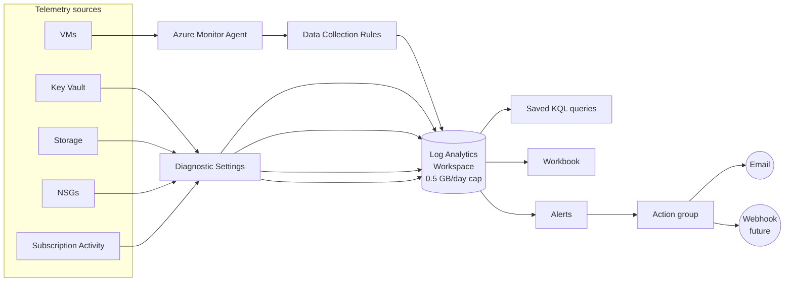

# Module 06 — Monitoring and logs

The observability layer of the **Secure Azure Administration Environment**. This module delivers a centralized Log Analytics workspace with a daily ingestion cap, the modern Azure Monitor Agent on every VM via Data Collection Rules, KQL queries that operationalize real on-call patterns (find the host with the most errors, alert on Key Vault access from unknown callers, trace which NSG rule denied a packet), metric and log-search and Activity Log alerts wired to action groups, and a workbook plus pinned dashboard that turn the workspace into a single pane of glass.

## What this module demonstrates

| Skill | Where it shows up |
|---|---|
| Centralized observability | Single Log Analytics workspace, all module diagnostics flowing in |
| Modern monitoring agent | Azure Monitor Agent (AMA) and Data Collection Rules — not the deprecated Log Analytics agent |
| KQL fluency | Ten saved queries covering errors, performance, signins, security, infra changes |
| Multiple alert types | Metric alerts, log search alerts, Activity Log alerts |
| Action groups | Email plus webhook design for fan-out routing |
| Workbooks and dashboards | Reusable workbook JSON, dashboard pinned with KQL tiles |
| Cost discipline | 0.5 GB/day ingestion cap protecting the workspace from runaway costs |

## Build steps

This module uses **Azure CLI for workspace and alert creation, KQL for query authoring, Bicep for the workspace module, and Portal for workbook design and dashboard composition** — those visual tools produce richer evidence than the equivalent CLI calls.

### 1. Create the centralized Log Analytics workspace

```bash
RG_P=rg-platform-lab-eastus-01
LOC=eastus
TAGS="Environment=lab Owner=$(whoami) CostCenter=portfolio ExpiryDate=$(date -d '+90 days' +%Y-%m-%d) Module=06-monitoring-logs"

az monitor log-analytics workspace create \
  --resource-group $RG_P \
  --workspace-name law-portfolio-lab-eastus-01 \
  --location $LOC \
  --retention-time 30 \
  --sku PerGB2018 \
  --tags $TAGS

LAW_ID=$(az monitor log-analytics workspace show \
  -g $RG_P -n law-portfolio-lab-eastus-01 --query id -o tsv)
```

The `PerGB2018` pricing tier is the current pay-as-you-go default. Retention is set to 30 days; the first 31 days are free, so 30 keeps the workspace at zero retention cost.

### 2. Set the daily ingestion cap

```bash
az monitor log-analytics workspace update \
  --resource-group $RG_P \
  --workspace-name law-portfolio-lab-eastus-01 \
  --workspace-capping daily-quota-gb=0.5
```

A 0.5 GB/day cap limits worst-case spend to roughly $35/month at standard ingestion rates. When the cap is hit, ingestion stops until the next day; this protects the workspace from a runaway log producer flooding the budget. In production, the cap is set higher and used as a circuit breaker; in this lab it doubles as a hard cost floor.

### 3. Configure Azure Monitor Agent via Data Collection Rule

The Azure Monitor Agent (AMA) is the current monitoring agent. The deprecated Log Analytics agent (also known as MMA, OMS) is end-of-life and not used in this portfolio.

`scripts/dcr-linux-syslog.json` (excerpt):

```json
{
  "properties": {
    "dataSources": {
      "syslog": [{
        "name": "syslog-default",
        "streams": ["Microsoft-Syslog"],
        "facilityNames": ["auth", "authpriv", "cron", "daemon", "syslog", "user"],
        "logLevels": ["Warning", "Error", "Critical", "Alert", "Emergency"]
      }],
      "performanceCounters": [{
        "name": "perf-default",
        "streams": ["Microsoft-Perf"],
        "samplingFrequencyInSeconds": 60,
        "counterSpecifiers": [
          "\\Processor(*)\\% Processor Time",
          "\\Memory(*)\\% Used Memory",
          "\\LogicalDisk(*)\\% Free Space"
        ]
      }]
    },
    "destinations": {
      "logAnalytics": [{
        "name": "law-destination",
        "workspaceResourceId": "<LAW_ID>"
      }]
    },
    "dataFlows": [{
      "streams": ["Microsoft-Syslog", "Microsoft-Perf"],
      "destinations": ["law-destination"]
    }]
  }
}
```

```bash
# Create the DCR
az monitor data-collection rule create \
  --resource-group $RG_P \
  --name dcr-linux-syslog-perf \
  --location $LOC \
  --rule-file scripts/dcr-linux-syslog.json \
  --tags $TAGS

# Associate with a VM (deploy a B1s test VM if none currently exists)
DCR_ID=$(az monitor data-collection rule show -g $RG_P -n dcr-linux-syslog-perf --query id -o tsv)
VM_ID=$(az vm show -g rg-compute-lab-eastus-01 -n vm-app-lab-eus-01 --query id -o tsv)

az monitor data-collection rule association create \
  --name dcra-vm-app-01 \
  --rule-id $DCR_ID \
  --resource $VM_ID

# Install the AMA extension
az vm extension set \
  --resource-group rg-compute-lab-eastus-01 \
  --vm-name vm-app-lab-eus-01 \
  --name AzureMonitorLinuxAgent \
  --publisher Microsoft.Azure.Monitor
```

The AMA + DCR pattern is the modern flow for VM monitoring. The advantages over the legacy agent: data collection is defined as a resource (DCR), associations are explicit, the same agent can send to multiple workspaces, and migration paths are first-class. Anyone still installing the legacy MMA agent in 2026 is shipping deprecated configuration.

### 4. Generate sample telemetry and run the canonical KQL search

```bash
# Generate sample errors on the VM
ssh azureuser@$VM_PUBLIC_IP <<'EOF'
for i in {1..5}; do
  logger -p daemon.err "test error message #$i — simulated application failure"
done
EOF
```

In the workspace's Logs blade, run:

```kusto
Syslog
| where TimeGenerated > ago(1h)
| where SeverityLevel in ("err", "error", "Error")
| project TimeGenerated, Computer, Facility, SeverityLevel, SyslogMessage
| sort by TimeGenerated desc
```

The same pattern works for Windows hosts using the `Event` table:

```kusto
Event
| where TimeGenerated > ago(1h)
| where EventLevelName == "Error"
| project TimeGenerated, Computer, Source, EventID, RenderedDescription
| sort by TimeGenerated desc
```

Both expressions use the `where … in (…)` pattern rather than concatenated `or` clauses; this is more readable, performs identically in KQL, and is the form the platform uses internally. KQL is filter-then-project; reverse the order and the query returns less but is no faster — readability is the deciding factor.

### 5. Author and save ten KQL queries

Saved queries form the working library that gets pinned to the dashboard, drives alerts, and serves as on-call runbook material. Save each to `scripts/queries/`:

| File | Purpose |
|---|---|
| `event-error.kql` | Recent errors across all hosts |
| `perf-cpu-high.kql` | Hosts at >80% CPU averaged over 5 minutes |
| `top-error-hosts.kql` | Top 10 hosts by error count over the last 24 hours |
| `signin-by-location.kql` | Risky sign-ins grouped by country (requires Entra ID Premium) |
| `resource-changes.kql` | Recent resource modifications via Activity Log |
| `alerts-by-severity.kql` | Alert volume bucketed by severity |
| `kv-unknown-caller.kql` | Key Vault access by unrecognized identities |
| `nsg-deny-trace.kql` | Which NSG rule denied a specific packet (requires flow logs) |
| `aad-risky-users.kql` | Users flagged at risk by Microsoft Entra ID Protection |
| `storage-anomalies.kql` | Spike in storage transactions or failed authorizations |

Example — `top-error-hosts.kql`:

```kusto
Syslog
| where TimeGenerated > ago(24h)
| where SeverityLevel in ("err", "error", "Error", "crit", "alert")
| summarize ErrorCount = count() by Computer
| top 10 by ErrorCount desc
```

Save each query in the workspace as a Function (Logs → query → Save → Save as function) so the rest of the catalog can reference it as a callable verb (`top_error_hosts | project Computer`).

### 6. Create an action group

```bash
az monitor action-group create \
  --resource-group rg-monitor-lab-eastus-01 \
  --name ag-portfolio-email \
  --short-name agpf \
  --action email AdminAlerts <your-email-address>
```

The action group is the abstraction between alerts and notification channels. Add a webhook action later (in module 09) to fan out to Logic Apps or Slack without touching the alert definitions.

### 7. Three alert types

A complete monitoring posture uses all three Azure alert types because each catches a different class of problem.

**Metric alert** — directly measures a metric the platform exposes:

```bash
VM_ID=$(az vm show -g rg-compute-lab-eastus-01 -n vm-app-lab-eus-01 --query id -o tsv)
AG_ID=$(az monitor action-group show -g rg-monitor-lab-eastus-01 -n ag-portfolio-email --query id -o tsv)

az monitor metrics alert create \
  --name alert-vm-cpu-high \
  --resource-group rg-monitor-lab-eastus-01 \
  --scopes $VM_ID \
  --condition "avg Percentage CPU > 80" \
  --window-size 5m --evaluation-frequency 1m \
  --severity 2 \
  --action $AG_ID
```

**Log search alert** — runs a KQL query on a schedule and alerts on the result:

```bash
az monitor scheduled-query create \
  --name alert-error-spike \
  --resource-group rg-monitor-lab-eastus-01 \
  --scopes $LAW_ID \
  --condition "count > 50" \
  --condition-query "Syslog | where TimeGenerated > ago(15m) | where SeverityLevel in ('err','error','Error') | summarize count()" \
  --window-size 15m --evaluation-frequency 5m \
  --action-groups $AG_ID
```

**Activity Log alert** — fires on control-plane events (resource deletions, policy changes, role assignments):

```bash
az monitor activity-log alert create \
  --name alert-resource-deleted \
  --resource-group rg-monitor-lab-eastus-01 \
  --condition category=Administrative operationName=Microsoft.Resources/subscriptions/resourceGroups/delete \
  --action-group $AG_ID
```

Trigger the metric alert by running the CPU stress test from module 04 against `vm-app-lab-eus-01`. Within 5–7 minutes, the alert fires and an email arrives. Capture the alert in fired state and the resulting email.

### 8. Workbook — VM operations summary

Portal navigation: Azure Monitor → Workbooks → + New. Add three sections with KQL tiles:

- **Heartbeat** — `Heartbeat | summarize LastSeen = max(TimeGenerated) by Computer | extend StaleMinutes = (now() - LastSeen) / 1m`
- **Performance** — CPU and memory time-charts using `Perf` table
- **Errors** — last 24 hours from `Syslog` and `Event`

Save the workbook with the name `Workbook — VM Operations`. Export the JSON to `scripts/workbook-vm-operations.json` so the workbook is reproducible from version control.

### 9. Pin to a custom dashboard

Portal navigation: Dashboard → + New dashboard. Pin: the workbook, the KQL query for top-error hosts, the metric chart for `vm-app-lab-eus-01` CPU, the Activity Log filter for resource modifications, and the Cost Analysis view by Module tag from module 01. Save and share dashboard JSON.

### 10. Diagnostic settings — funnel everything to the workspace

For each resource type from earlier modules, configure diagnostic settings to route logs and metrics into `law-portfolio-lab-eastus-01`:

```bash
# Example: Key Vault diagnostic settings (KV created in module 08)
KV_ID=$(az keyvault show -n kv-portfolio-lab-eus-01 --query id -o tsv)

az monitor diagnostic-settings create \
  --name diag-kv-to-law \
  --resource $KV_ID \
  --workspace $LAW_ID \
  --logs '[{"category":"AuditEvent","enabled":true},{"category":"AzurePolicyEvaluationDetails","enabled":true}]' \
  --metrics '[{"category":"AllMetrics","enabled":true}]'
```

Repeat for the storage account, NSGs, VMs, and the Recovery Services Vault. Each diagnostic setting sends data into a typed table in the workspace; the queries above can then join across resource types — for example, correlating a Key Vault access denial with the NSG that blocked the calling VM.

### 11. ITSM connector and Logic App alternatives — design only

`docs/itsm-and-logic-app-alternatives.md` documents two ways to extend alert routing beyond email:

- **ITSM Connector** — connects Azure Monitor to ServiceNow, BMC, Cherwell, or Provance. Action groups gain an "ITSM" action type that creates incidents directly. Right tool when an incident-management system already exists.
- **Logic App action** — webhook trigger on the action group routes the alert payload through any Logic App. Right tool when downstream routing is custom (Slack channel, custom ticketing, escalation rules, on-call rotation lookup).

Neither is deployed in the lab — there is no target ITSM system to connect to and Logic App consumption is documented in module 09.

## Validation

- `Heartbeat` table in the workspace shows entries for the AMA-instrumented VM within 5 minutes of agent install.
- `az monitor log-analytics workspace show -g $RG_P -n law-portfolio-lab-eastus-01 --query "workspaceCapping.dailyQuotaGb"` returns `0.5`.
- `Syslog | where TimeGenerated > ago(1h) | count` returns a non-zero value after the test logger calls.
- The metric alert fires within 5–7 minutes of CPU stress; the email arrives at the configured address.
- The Activity Log alert fires when a test resource is deleted.
- The workbook JSON imports successfully into a fresh workbook (reproducibility test).

## Cleanup

The workspace, DCR, action group, and alerts are part of the sustained baseline (~$2–4/month). The metric alerts cost $0.10 each per month; keep only those tied to live evidence. Disable the log search alert if not actively used (it is the most expensive at ~$1.50/month each).

```bash
# Disable an alert without deleting it
az monitor metrics alert update -g rg-monitor-lab-eastus-01 -n alert-vm-cpu-high --enabled false
```

If the workspace daily cap is hit during a stress test, ingestion will resume the next day automatically.

**Cost:** ~$2–4/month sustained. No build-and-tear-down resources in this module.

## Evidence

| File | Demonstrates |
|---|---|
| `screenshots/06-law-created.png` | Workspace overview blade with retention and SKU |
| `screenshots/06-law-daily-cap.png` | Workspace daily quota set to 0.5 GB |
| `screenshots/06-dcr-association.png` | DCR associated with a VM |
| `screenshots/06-ama-installed.png` | AMA extension installed on the VM |
| `screenshots/06-kql-syslog-error.png` | Syslog error query results |
| `screenshots/06-kql-top-error-hosts.png` | Top error hosts aggregated by Computer |
| `screenshots/06-saved-functions.png` | Saved KQL functions in the workspace |
| `screenshots/06-action-group.png` | Action group with email action |
| `screenshots/06-metric-alert-fired.png` | Metric alert in fired state after CPU stress |
| `screenshots/06-log-alert.png` | Log search alert configuration |
| `screenshots/06-activity-alert.png` | Activity Log alert configuration |
| `screenshots/06-alert-email-received.png` | Notification email received (sender details redacted) |
| `screenshots/06-workbook.png` | Workbook with three KQL tiles |
| `screenshots/06-dashboard.png` | Custom dashboard pinned with monitoring tiles |
| `screenshots/06-kv-diagnostic-to-law.png` | Key Vault diagnostic settings sending to workspace |
| `scripts/dcr-linux-syslog.json` | DCR for Linux Syslog and Performance |
| `scripts/dcr-windows-event.json` | DCR for Windows Event and Performance |
| `scripts/queries/event-error.kql` through `scripts/queries/storage-anomalies.kql` | Ten saved KQL queries |
| `scripts/workbook-vm-operations.json` | Workbook export |
| `scripts/dashboard.json` | Dashboard export |
| `diagrams/06-azmon-architecture.mmd` | Azure Monitor data plane architecture |
| `docs/decisions/ADR-0009-centralized-law.md` | Decision: one centralized workspace vs per-team |
| `docs/itsm-and-logic-app-alternatives.md` | Routing options beyond email |

### Mermaid diagram embedded — Azure Monitor architecture



## Resume bullets

- Designed and deployed centralized observability for an Azure subscription with a single Log Analytics workspace receiving diagnostic data from VMs (via Azure Monitor Agent and Data Collection Rules), Key Vault, storage, NSGs, and Activity Log.
- Authored ten saved KQL queries operationalizing real on-call patterns including error aggregation, performance threshold detection, sign-in geographic anomalies, NSG deny tracing, and Key Vault access by unknown callers; saved as workspace functions for reuse across alerts and dashboards.
- Implemented a multi-tier alerting strategy combining metric alerts (CPU thresholds), log search alerts (KQL-driven detections), and Activity Log alerts (control-plane events), all routed through a single action group for unified notification routing.
- Published an Azure Monitor workbook and custom dashboard with embedded KQL queries and metric charts, exported to JSON for reproducible deployment via Bicep or GitHub Actions.
- Migrated VM monitoring from the deprecated Log Analytics agent to Azure Monitor Agent with explicit Data Collection Rules, ensuring forward compatibility with Microsoft's current monitoring path.
- Enforced cost discipline on the workspace via a 0.5 GB/day ingestion cap, capturing data for evidence without exposing the lab to runaway log volumes.

## Interview story

The story is *the daily cap as a circuit breaker*. The most expensive monitoring incident in any cloud environment happens when a buggy application or a misconfigured agent starts shipping gigabytes per hour into the workspace, undetected, until the bill arrives. The defensible answer when an interviewer asks "How do you protect monitoring spend?" is the daily cap setting, configured before the first byte of telemetry flows. In this lab the cap is 0.5 GB/day; in production it would be sized to the expected baseline plus 50%. When the cap trips, ingestion stops until the next day — the platform reverts to a known-good cost ceiling without operator intervention. The deeper lesson is the same as the storage account in module 05: secure (or in this case, cost-bounded) defaults set at creation time outperform monitoring-and-react patterns. Monitoring monitoring is the question that ends infinite-regress conversations; the cap is the answer.
