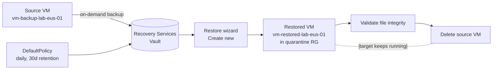

# Module 07 — Backup and recovery

The recoverability layer of the **Secure Azure Administration Environment**. This module delivers a Recovery Services Vault, a backup policy, a single VM protected by that policy, an on-demand backup, and two restore demonstrations: file-level recovery to a different VM via the iSCSI script, and full-VM restore to a new resource group as a "rebuild a destroyed workload" drill. Azure Site Recovery is documented as an architecture diagram with the modern managed-disk replication path, since deploying full ASR replication exceeds the lab's cost ceiling.

## What this module demonstrates

| Skill | Where it shows up |
|---|---|
| Recovery Services Vault | Created with LRS redundancy, soft-delete configured for lab cycle time |
| Backup policy | Daily backup schedule, 30-day retention |
| Restore drill — file level | iSCSI mount to a different VM, file copy, unmount |
| Restore drill — full VM | Restore as new VM in a quarantine RG, validate, then delete source |
| ASR design literacy | Modern managed-disk replication architecture documented |
| Backup Center | Cross-vault visibility |
| Cleanup gotchas | Stop protection with delete-data before vault delete |

## Build steps

This module uses **Azure CLI for vault and backup creation, Portal for restore wizards** because the wizards walk through the recovery point selection and target configuration in a way that produces clearer evidence than the CLI equivalent.

### 1. Create the Recovery Services Vault

```bash
RG_B=rg-backup-lab-eastus-01
LOC=eastus
TAGS="Environment=lab Owner=$(whoami) CostCenter=portfolio ExpiryDate=$(date -d '+90 days' +%Y-%m-%d) Module=07-backup-recovery"

az backup vault create \
  --resource-group $RG_B \
  --name rsv-portfolio-lab-eastus-01 \
  --location $LOC

# Apply tags after creation (the create command does not accept tags directly for RSV)
az resource tag \
  --resource-group $RG_B \
  --name rsv-portfolio-lab-eastus-01 \
  --resource-type Microsoft.RecoveryServices/vaults \
  --tags $TAGS

# Set redundancy to LRS for the lab — must happen before any backup is taken
az backup vault backup-properties set \
  --resource-group $RG_B \
  --name rsv-portfolio-lab-eastus-01 \
  --backup-storage-redundancy LocallyRedundant
```

Production vaults default to GRS (geo-redundant); LRS is half the storage cost and acceptable for a lab where the goal is demonstrating the workflow rather than surviving a regional outage. The decision is captured in `docs/decisions/ADR-0010-rsv-soft-delete-lab.md`.

### 2. Configure soft-delete for lab cycle time

```bash
# Disable soft delete to avoid the 14-day waiting period when the lab tears down
az backup vault backup-properties set \
  --resource-group $RG_B \
  --name rsv-portfolio-lab-eastus-01 \
  --soft-delete-feature-state Disable
```

**Lab-specific decision.** Soft-delete in production protects against accidental or malicious deletion of backup data — a 14-day grace period during which "deleted" recovery points can still be restored. In the lab, this 14-day period blocks rapid teardown. The decision record explains the production posture and the lab override side-by-side; this is a documented exception, not a default to copy.

### 3. Create the backup policy

```bash
# Use the built-in DefaultPolicy as a starting point and verify retention
az backup policy show \
  --resource-group $RG_B \
  --vault-name rsv-portfolio-lab-eastus-01 \
  --name DefaultPolicy
```

For the lab, `DefaultPolicy` (daily backup, 30-day retention) is the right starting point. Custom policies with weekly/monthly/yearly retention points are documented in `docs/backup-policy-design.md` for reference.

### 4. Provision a VM to back up

```bash
RG_C=rg-compute-lab-eastus-01
az vm create -g $RG_C -n vm-backup-lab-eus-01 \
  --image Ubuntu2404 --size Standard_B1s \
  --vnet-name vnet-spoke-prod-lab-eastus-01 --subnet snet-app \
  --admin-username azureuser --generate-ssh-keys --tags $TAGS

# Create some files to back up so restore validation has something to verify
ssh azureuser@$(az vm show -g $RG_C -n vm-backup-lab-eus-01 -d --query publicIps -o tsv) <<'EOF'
mkdir -p /home/azureuser/critical-data
for i in {1..10}; do
  echo "Critical record $i — generated $(date -Is)" > /home/azureuser/critical-data/record-${i}.txt
done
ls -la /home/azureuser/critical-data/
EOF
```

### 5. Enable backup for the VM

```bash
az backup protection enable-for-vm \
  --resource-group $RG_B \
  --vault-name rsv-portfolio-lab-eastus-01 \
  --vm $(az vm show -g $RG_C -n vm-backup-lab-eus-01 --query id -o tsv) \
  --policy-name DefaultPolicy
```

### 6. Trigger an on-demand backup

```bash
# The first backup is slow (initial replica copy); 30–60 minutes is normal for a small VM
az backup protection backup-now \
  --resource-group $RG_B \
  --vault-name rsv-portfolio-lab-eastus-01 \
  --container-name vm-backup-lab-eus-01 \
  --item-name vm-backup-lab-eus-01 \
  --backup-management-type AzureIaasVM
```

Track the job in the portal at the vault → Backup Jobs blade. Capture the completed job to evidence.

### 7. File-level restore to a different VM

This is the most-tested recovery scenario. The recovery target is a **second** VM, not the original — proving that the backup is portable across instances and recoverable even when the source is destroyed.

Provision a second VM in the same VNet:

```bash
az vm create -g $RG_C -n vm-restore-target-lab-eus-01 \
  --image Ubuntu2404 --size Standard_B1s \
  --vnet-name vnet-spoke-prod-lab-eastus-01 --subnet snet-app \
  --admin-username azureuser --generate-ssh-keys --tags $TAGS
```

Portal navigation: vault → Backup items → Azure Virtual Machine → vm-backup-lab-eus-01 → File Recovery. The wizard generates a Python script that mounts the recovery point as iSCSI volumes. Download the script and run it on the **second** VM:

```bash
# On vm-restore-target-lab-eus-01
sudo python3 /tmp/IaasVMILRExeForLinux.py
# Recovery volumes are mounted at /home/azureuser/<path-to-mount>
ls /home/azureuser/critical-data/
cp /home/azureuser/critical-data/*.txt /tmp/recovered/
```

After copying the files, unmount via the portal (vault → File Recovery → Unmount Disks). Capture the mounted state, the file copy, and the unmount confirmation.

### 8. Full-VM restore to a quarantine resource group

The "ransomware drill": pretend the source VM has been destroyed. Restore to a new VM in a different resource group, validate, then delete the source and confirm the new VM is fully functional standalone.

Portal navigation: vault → Backup items → vm-backup-lab-eus-01 → Restore VM. Choose:

- Restore Type: **Create new**
- Restore configuration: VM name `vm-restored-lab-eus-01`, resource group `rg-backup-lab-eastus-01` (treating the backup RG as quarantine)
- Network: same VNet, same subnet
- Storage account: any in the same region

The restore takes 30–90 minutes. While waiting, capture the wizard configuration screens.

After restore completes, validate:

```bash
RESTORED_IP=$(az vm show -g $RG_B -n vm-restored-lab-eus-01 -d --query publicIps -o tsv)
ssh azureuser@$RESTORED_IP 'ls /home/azureuser/critical-data/'
# All 10 files should be present
```

Delete the source VM to prove the restored VM is independent:

```bash
az vm delete -g $RG_C -n vm-backup-lab-eus-01 --yes
ssh azureuser@$RESTORED_IP 'echo "Source destroyed at $(date)" >> /home/azureuser/critical-data/post-restore.log'
# Restored VM is still operational
```

### 9. Backup Center for cross-vault visibility

Portal → Backup center. Capture the cross-vault summary view. Backup Center aggregates protected items, jobs, and alerts across all RSVs in the subscription — useful when scaling beyond a single vault.

### 10. Backup reports to Log Analytics

Vault → Backup Reports → Configure. Wire the vault's reporting data to the Log Analytics workspace from module 06. Reports populate after about 24 hours and feed into the workbook from module 06.

### 11. Azure Site Recovery — design only

Full ASR with replication is documented but not deployed. The design captures the modern managed-disk replication path (no separate cache storage account required), the replication policy structure (RPO, recovery point retention, app-consistent snapshot frequency), and the failover and failback workflow.

`diagrams/07-asr-managed-disks.mmd`:

```mermaid
flowchart LR
    subgraph Source["Source region — eastus"]
        SVMs[Source VMs]
        SDisks[Managed disks]
    end

    subgraph DR["Recovery region — westus2"]
        TVMs[Recovery VMs<br/>created at failover time]
        TDisks[Replicated managed disks]
    end

    RSV[Recovery Services Vault]
    Policy[Replication policy<br/>RPO target, retention, app-consistent freq]

    SDisks -->|continuous replication<br/>managed-disk path| TDisks
    RSV --> Policy --> SDisks
    SVMs -.x.- TVMs
    SDisks -.failover.- TDisks
```

The decision to defer ASR deployment is in the lab cost trade-off: per-VM replication storage and compute are billed continuously, and the architecture diagram with documented configuration steps demonstrates the concept without the bill.

## Validation

- The on-demand backup job completes successfully in the Backup Jobs blade.
- The file-level recovery script mounts the recovery point on the second VM and the recovered files match the original content.
- The full-VM restore produces a new VM in a different resource group with the original files intact.
- After deleting the source VM, the restored VM remains operational, proving recovery independence.
- Backup Center shows the protected item count consistent with the vault.

## Cleanup

This module's cleanup is the most error-prone in the portfolio. The order matters: stop protection with delete-data **before** deleting the vault.

```bash
# 1. Stop protection AND delete recovery points
az backup protection disable \
  --resource-group $RG_B \
  --vault-name rsv-portfolio-lab-eastus-01 \
  --container-name vm-backup-lab-eus-01 \
  --item-name vm-backup-lab-eus-01 \
  --backup-management-type AzureIaasVM \
  --delete-backup-data true \
  --yes

# 2. Wait for the disable job to complete (check vault → Backup Jobs)

# 3. Verify no protected items remain
az backup item list \
  --resource-group $RG_B \
  --vault-name rsv-portfolio-lab-eastus-01 \
  --backup-management-type AzureIaasVM \
  -o table

# 4. Delete the vault
az backup vault delete \
  --resource-group $RG_B \
  --name rsv-portfolio-lab-eastus-01 \
  --yes

# 5. Tear down the source and restored VMs
az vm delete -g $RG_C -n vm-backup-lab-eus-01 --yes 2>/dev/null
az vm delete -g $RG_C -n vm-restore-target-lab-eus-01 --yes
az vm delete -g $RG_B -n vm-restored-lab-eus-01 --yes

# 6. Sweep orphan disks and NICs
az disk list --query "[?managedBy==null].id" -o tsv | xargs -r -n1 az disk delete --yes --ids
az network nic list --query "[?virtualMachine==null].id" -o tsv | xargs -r -n1 az network nic delete --ids
```

If the vault delete fails with "vault contains protected items" — soft-delete is still on, or the disable job did not include `--delete-backup-data true`. The fix is to re-run step 1.

**Cost:** ~$5–10 spent on this module across the demonstration session (vault + protected item + storage). Sustained add: $0/month after teardown.

## Evidence

| File | Demonstrates |
|---|---|
| `screenshots/07-rsv-created.png` | Recovery Services Vault overview with LRS redundancy |
| `screenshots/07-rsv-soft-delete-disabled.png` | Soft-delete disabled with documented rationale |
| `screenshots/07-backup-policy.png` | DefaultPolicy details — daily, 30-day retention |
| `screenshots/07-backup-enabled.png` | Protection enabled for vm-backup-lab-eus-01 |
| `screenshots/07-backup-job-completed.png` | On-demand backup job in completed state |
| `screenshots/07-file-recovery-script.png` | iSCSI mount script downloaded |
| `screenshots/07-file-recovery-mounted.png` | Recovery volumes mounted on the second VM |
| `screenshots/07-file-recovery-files.png` | Original files visible after iSCSI mount |
| `screenshots/07-vm-restore-wizard.png` | Restore wizard configured for "Create new" |
| `screenshots/07-vm-restore-completed.png` | Restored VM running in the quarantine RG |
| `screenshots/07-restored-vm-files.png` | Critical files present on the restored VM |
| `screenshots/07-source-deleted-restored-running.png` | Source VM deleted, restored VM still operational |
| `screenshots/07-backup-center.png` | Backup Center cross-vault summary |
| `screenshots/07-backup-reports-to-law.png` | Backup reports configured to send to LA workspace |
| `diagrams/07-asr-managed-disks.mmd` | Modern ASR replication architecture |
| `diagrams/07-file-recovery-iscsi.mmd` | File-recovery iSCSI mount workflow |
| `diagrams/07-restore-drill-flow.mmd` | Full-VM restore drill workflow |
| `docs/backup-policy-design.md` | Custom policy patterns for weekly/monthly/yearly retention |
| `docs/decisions/ADR-0010-rsv-soft-delete-lab.md` | Decision: soft-delete disabled for lab cycle time |

### Mermaid diagram embedded — restore drill flow



## Resume bullets

- Designed and operated an Azure Recovery Services Vault with backup policies, on-demand backup execution, and two-tier restore validation: file-level recovery to a different VM via iSCSI mount and full-VM restore to a quarantine resource group simulating a destroyed-workload recovery drill.
- Captured an end-to-end ransomware-style restore drill — backup taken, source VM destroyed, replacement VM restored from recovery point in a separate resource group, file integrity validated, restored VM operating independently of the destroyed source.
- Authored an ASR design for the modern managed-disk replication path, documenting RPO/retention/app-consistent snapshot configuration without incurring continuous replication costs in the lab.
- Operationalized backup observability via Backup Center cross-vault summaries and Backup Reports feeding the centralized Log Analytics workspace for KQL-based job-success analysis.
- Documented and validated the production-vs-lab soft-delete trade-off — soft-delete enabled for production resilience, disabled in the lab for rapid teardown, with the decision recorded in an Architecture Decision Record.

## Interview story

The story is the *full restore to a quarantine RG with the source destroyed*. When asked "How do you know your backups work?" the wrong answers are "we run the backup daily" or "we have the policy configured." The right answer is "I restore to a parallel resource group, validate the data, then destroy the source and verify the restored workload runs independently." This module captures exactly that drill — backup taken, file integrity confirmed on the restored VM, source VM deleted, restored VM still operational five minutes later writing new data. The principle is that backups are not real until they have been restored, and restored once a year is an audit theater answer, not an operational one. The interviewer is looking for someone who knows that recovery is a habit, not a project. This module is one drill; the discipline is doing it every quarter for every protected workload class.
