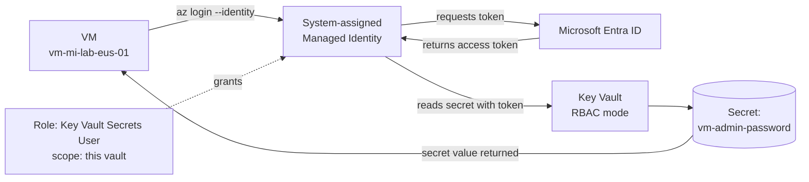

# Module 08 — Security operations

The security plane of the **Secure Azure Administration Environment**. This module delivers a Key Vault in RBAC permission mode, a system-assigned Managed Identity on a VM, the end-to-end pattern of a VM authenticating to Key Vault using its identity (no stored credentials), Microsoft Defender for Cloud baseline with documented secure score before/after, Just-in-Time VM access with Defender for Servers Plan 1, customer-managed key encryption for the storage account from module 05, and a KV firewall plus diagnostic-driven alert that catches access by unrecognized callers.

## What this module demonstrates

| Skill | Where it shows up |
|---|---|
| Modern Key Vault posture | RBAC permission mode (not legacy access policies) with role granularity |
| Managed Identity end-to-end | VM gets system-assigned identity, role-assigned to KV, fetches secret via `az login --identity` |
| User-assigned MI for sharing | One identity attached to multiple VMs sharing the same Key Vault grant |
| Defender for Cloud baseline | Foundational tier enabled, secure score captured before and after remediation |
| JIT VM access | Defender for Servers Plan 1, time-bounded NSG opens with approval workflow |
| Customer-managed keys | Storage account encryption rotated to a Key Vault-stored key |
| KV firewall | Public access restricted to specific IPs, validated by a denied connection |
| KQL alert on KV | Saved query alerting on access by unknown service principals |

## Build steps

This module uses **Azure CLI for KV creation, MI assignment, and role grants**, **Bicep for Key Vault parameter templates**, and **Portal for Defender for Cloud screenshots** because the secure-score visualizations are richer in the portal than in CLI output.

### 1. Create the Key Vault in RBAC permission mode

```bash
RG_SEC=rg-security-lab-eastus-01
LOC=eastus
TAGS="Environment=lab Owner=$(whoami) CostCenter=portfolio ExpiryDate=$(date -d '+90 days' +%Y-%m-%d) Module=08-security-operations"
KV_NAME="kv-portfolio-lab-eus-$(openssl rand -hex 2)"

az keyvault create \
  --resource-group $RG_SEC \
  --name $KV_NAME \
  --location $LOC \
  --enable-rbac-authorization true \
  --enabled-for-template-deployment true \
  --enabled-for-disk-encryption true \
  --enable-soft-delete true \
  --retention-days 90 \
  --enable-purge-protection true \
  --public-network-access Enabled \
  --tags $TAGS
```

Six explicit settings:

- **`--enable-rbac-authorization true`** — uses Azure RBAC roles for permission management, replacing the legacy access policies model. The current Microsoft-recommended path; access policies are the older mechanism kept for backward compatibility.
- **`--enabled-for-template-deployment true`** — allows ARM/Bicep templates to reference secrets via the `getSecret()` function during deployment.
- **`--enabled-for-disk-encryption true`** — allows the platform's disk encryption services to access keys.
- **`--enable-soft-delete true`** with 90-day retention — recovers deleted vaults and secrets within the retention period.
- **`--enable-purge-protection true`** — prevents permanent deletion even by privileged users until the soft-delete period elapses.

Public network access is left enabled at creation for initial access; the firewall and (optionally) a private endpoint replace it later in the module.

### 2. Assign yourself Key Vault Administrator

Because RBAC mode is in effect, even the user who created the vault needs an explicit role to read or write secrets:

```bash
KV_ID=$(az keyvault show -n $KV_NAME --query id -o tsv)
ME=$(az ad signed-in-user show --query id -o tsv)

az role assignment create \
  --assignee-object-id $ME \
  --assignee-principal-type User \
  --role "Key Vault Administrator" \
  --scope $KV_ID
```

The role granularity in RBAC mode is finer than legacy access policies. Common roles:

| Role | Grants |
|---|---|
| Key Vault Administrator | Full data-plane access (secrets, keys, certificates) |
| Key Vault Secrets Officer | Read, write, delete secrets |
| Key Vault Secrets User | Read secrets only |
| Key Vault Crypto Officer | Manage keys |
| Key Vault Crypto User | Use keys (sign, encrypt) without managing them |
| Key Vault Reader | Read metadata only |

The least-privilege pattern is to grant `Secrets User` to a workload identity that only needs to read secrets at runtime, never `Administrator`.

### 3. Add a secret, a certificate, and a key

```bash
# Secret — represents a database password or API token
az keyvault secret set \
  --vault-name $KV_NAME \
  --name vm-admin-password \
  --value "$(openssl rand -base64 24)"

# Self-signed certificate
az keyvault certificate create \
  --vault-name $KV_NAME \
  --name cert-portfolio-test \
  --policy "$(az keyvault certificate get-default-policy)"

# Key (RSA 2048) — used for the storage account CMK in step 7
az keyvault key create \
  --vault-name $KV_NAME \
  --name key-storage-cmk \
  --kty RSA --size 2048
```

### 4. Configure Key Vault diagnostic settings

```bash
LAW_ID=$(az monitor log-analytics workspace show \
  -g rg-platform-lab-eastus-01 -n law-portfolio-lab-eastus-01 --query id -o tsv)

az monitor diagnostic-settings create \
  --name diag-kv-to-law \
  --resource $KV_ID \
  --workspace $LAW_ID \
  --logs '[{"category":"AuditEvent","enabled":true},{"category":"AzurePolicyEvaluationDetails","enabled":true}]' \
  --metrics '[{"category":"AllMetrics","enabled":true}]'
```

Every secret read, key use, and policy evaluation now lands in the `AzureDiagnostics` table in the Log Analytics workspace and can be queried with KQL.

### 5. KQL alert — unknown caller accessing Key Vault

`scripts/queries/kv-unknown-caller.kql`:

```kusto
let known_principals = dynamic([
  "<your-user-object-id>",
  "<vm-system-mi-object-id>"
]);
AzureDiagnostics
| where ResourceProvider == "MICROSOFT.KEYVAULT"
| where OperationName in ("SecretGet", "KeyGet", "CertificateGet")
| where identity_claim_oid_g !in (known_principals)
| project TimeGenerated, identity_claim_upn_s, identity_claim_oid_g, OperationName, ResultType, requestUri_s
| sort by TimeGenerated desc
```

Save the query as a function and create a log search alert with this query as its condition. The alert fires if any object ID outside the known list reads from the vault.

### 6. Managed Identity — system-assigned, end-to-end

The pattern: a VM gets an identity, the identity is assigned `Key Vault Secrets User` on the vault, and the VM's local `az login --identity` works without any stored credentials.

```bash
RG_C=rg-compute-lab-eastus-01

# Create a VM with a system-assigned MI
az vm create -g $RG_C -n vm-mi-lab-eus-01 \
  --image Ubuntu2404 --size Standard_B1s \
  --vnet-name vnet-spoke-prod-lab-eastus-01 --subnet snet-app \
  --admin-username azureuser --generate-ssh-keys \
  --assign-identity '[system]' --tags $TAGS

# Capture the MI object ID
MI_ID=$(az vm identity show -g $RG_C -n vm-mi-lab-eus-01 --query principalId -o tsv)

# Grant Key Vault Secrets User on the vault
az role assignment create \
  --assignee-object-id $MI_ID \
  --assignee-principal-type ServicePrincipal \
  --role "Key Vault Secrets User" \
  --scope $KV_ID
```

SSH to the VM and fetch the secret using the identity:

```bash
ssh azureuser@$VM_PUBLIC_IP <<'REMOTE_EOF'
# No az login --service-principal — the identity is supplied by the platform
az login --identity
az account show --query "user.assignedIdentityInfo" -o tsv
# Fetch the secret
az keyvault secret show \
  --vault-name <kv-name> \
  --name vm-admin-password \
  --query value -o tsv | head -c 8
echo "...redacted"
REMOTE_EOF
```

The screenshot is masked at capture time — show that the call succeeded, but never show the actual secret value.

### 7. User-assigned Managed Identity for shared-secret patterns

When two or more VMs need to share the same Key Vault grant — for example, a fleet of API hosts — system-assigned identities require each VM to be granted individually. A **user-assigned** MI is created once, granted once, and attached to every VM that needs it.

```bash
# Create the user-assigned identity
az identity create -g $RG_SEC -n mi-shared-kv-readers --tags $TAGS

UAMI_ID=$(az identity show -g $RG_SEC -n mi-shared-kv-readers --query id -o tsv)
UAMI_PRINCIPAL=$(az identity show -g $RG_SEC -n mi-shared-kv-readers --query principalId -o tsv)

# Grant once
az role assignment create \
  --assignee-object-id $UAMI_PRINCIPAL \
  --assignee-principal-type ServicePrincipal \
  --role "Key Vault Secrets User" \
  --scope $KV_ID

# Attach to a second VM (creating it for this demonstration)
az vm create -g $RG_C -n vm-mi-shared-lab-eus-01 \
  --image Ubuntu2404 --size Standard_B1s \
  --vnet-name vnet-spoke-prod-lab-eastus-01 --subnet snet-app \
  --admin-username azureuser --generate-ssh-keys \
  --assign-identity $UAMI_ID --tags $TAGS
```

The decision rule for system vs user-assigned is in `docs/decisions/ADR-0012-system-vs-user-mi.md`. System-assigned for one-VM-one-identity; user-assigned for shared identity across multiple resources.

### 8. Microsoft Defender for Cloud — baseline and remediation

Defender for Cloud's foundational tier is free across the subscription. Enable from the portal: Microsoft Defender for Cloud → Environment settings → subscription → keep all plans Off initially. Capture the secure score baseline.

```bash
# Verify the foundational tier
az security pricing list --query "value[?pricingTier=='Free'].name" -o tsv
```

Apply the three highest-impact recommendations from the secure score:

- Enable MFA for accounts with owner permissions on the subscription (covered in module 02 Conditional Access).
- Restrict storage public access (already done in module 05).
- Enable diagnostic logging on Key Vault (done in step 4 above).

Wait 24 hours for the secure score to recompute, then capture it again. The before/after pair is the evidence.

### 9. Just-in-Time VM access

JIT requires Defender for Servers Plan 1. Enable for the duration of the demonstration:

```bash
az security pricing create -n VirtualMachines --tier Standard --subplan P1
```

Portal navigation: Microsoft Defender for Cloud → Workload protections → Just-in-time VM access → Configure for `vm-mi-lab-eus-01`. Configure SSH (port 22) with maximum 3-hour open window, source IP set to "Request IP".

Demonstrate the workflow:

1. Request access from the portal.
2. Capture the temporary NSG rule that opens 22 to your source IP.
3. SSH in successfully.
4. Wait for the configured timeout (or revoke).
5. Capture the NSG rule absent after timeout.

After capturing evidence, **disable the plan** to stop billing:

```bash
az security pricing create -n VirtualMachines --tier Free
```

### 10. Customer-managed key for the storage account

The storage account from module 05 currently uses Microsoft-managed keys. Switching to customer-managed keys (CMK) demonstrates regulated-storage patterns where the encryption material is held by the customer.

```bash
# Grant the storage account's MI Key Vault Crypto Service Encryption User on the KV
SA_NAME=$(cat /tmp/sa.name)
az storage account update \
  --name $SA_NAME \
  --resource-group rg-storage-lab-eastus-01 \
  --assign-identity

SA_MI=$(az storage account show -n $SA_NAME -g rg-storage-lab-eastus-01 --query identity.principalId -o tsv)

az role assignment create \
  --assignee-object-id $SA_MI \
  --assignee-principal-type ServicePrincipal \
  --role "Key Vault Crypto Service Encryption User" \
  --scope $KV_ID

# Configure CMK
az storage account update \
  --name $SA_NAME \
  --resource-group rg-storage-lab-eastus-01 \
  --encryption-key-source Microsoft.Keyvault \
  --encryption-key-vault https://$KV_NAME.vault.azure.net/ \
  --encryption-key-name key-storage-cmk \
  --encryption-key-version "" 
```

The empty key version enables automatic rotation: when a new version of the key is created in the vault, the storage account picks it up without operator action. Key rotation in CMK setups is the operational pattern that makes "we encrypt with our keys" actually mean something — without rotation, CMK is theatre.

### 11. Key Vault firewall

```bash
# Restrict to your IP only
MY_IP=$(curl -s https://api.ipify.org)
az keyvault network-rule add \
  --name $KV_NAME --ip-address $MY_IP/32

az keyvault update \
  --name $KV_NAME \
  --default-action Deny

# From the same workstation, secret access still works
az keyvault secret show --vault-name $KV_NAME --name vm-admin-password --query value -o tsv

# From any other source, access fails — capture the error from a different network
```

For full lockdown, replace the IP allowlist with a private endpoint pointing at the same private DNS zone pattern from module 05. The private endpoint is the correct production posture; IP allowlisting is acceptable for the lab where the VM-from-VNet path is already enabled by service tag NSG rules.

## Validation

- `az keyvault show -n $KV_NAME --query "properties.enableRbacAuthorization"` returns `true`.
- The VM with system-assigned MI runs `az login --identity && az keyvault secret show ...` successfully without any stored credentials.
- The same secret-fetch attempt from a VM **without** the role grant fails with an authorization error.
- Defender for Cloud secure score increases measurably 24 hours after applying the three recommendations.
- A JIT request opens an NSG rule that is automatically removed when the configured time elapses.
- The storage account encryption key shows the customer-managed key reference in the encryption blade.
- Connecting to KV from a non-allowlisted IP returns a 403 Forbidden.

## Cleanup

The Key Vault is part of the sustained baseline (~$0.10/month). Keep it. The user-assigned MI and the role assignments are free; keep them. The JIT-test VM, MI VMs, and Defender for Servers Plan are torn down after evidence capture.

```bash
# Disable Defender for Servers
az security pricing create -n VirtualMachines --tier Free

# Tear down test VMs
az vm delete -g $RG_C -n vm-mi-lab-eus-01 --yes
az vm delete -g $RG_C -n vm-mi-shared-lab-eus-01 --yes

# Sweep orphans
az disk list -g $RG_C --query "[?managedBy==null].id" -o tsv | xargs -r -n1 az disk delete --yes --ids
az network nic list -g $RG_C --query "[?virtualMachine==null].id" -o tsv | xargs -r -n1 az network nic delete --ids
```

If you opt to revert CMK back to Microsoft-managed keys (faster cleanup at end-of-portfolio):

```bash
az storage account update \
  --name $SA_NAME \
  --resource-group rg-storage-lab-eastus-01 \
  --encryption-key-source Microsoft.Storage
```

**Cost:** ~$1–3 spent on this module. Sustained add: <$1/month for Key Vault operations.

## Evidence

| File | Demonstrates |
|---|---|
| `screenshots/08-kv-rbac-mode.png` | Key Vault overview with RBAC permission mode enabled |
| `screenshots/08-kv-roles-list.png` | Available Key Vault roles in Azure RBAC |
| `screenshots/08-kv-secret-cert-key.png` | Secret, certificate, and key visible in the vault |
| `screenshots/08-kv-diagnostic-settings.png` | Diagnostic settings sending AuditEvent to Log Analytics |
| `screenshots/08-vm-mi-enabled.png` | VM with system-assigned Managed Identity |
| `screenshots/08-mi-role-on-kv.png` | MI granted Key Vault Secrets User on the vault |
| `screenshots/08-az-login-identity-success.png` | `az login --identity` returning a token from the VM |
| `screenshots/08-mi-fetches-secret.png` | Secret fetched via MI (value redacted in image) |
| `screenshots/08-uami-attached-multi-vm.png` | User-assigned MI attached to two VMs |
| `screenshots/08-defender-baseline.png` | Defender for Cloud secure score before remediation |
| `screenshots/08-defender-after.png` | Defender for Cloud secure score 24 hours after remediation |
| `screenshots/08-jit-config.png` | JIT VM access policy configuration |
| `screenshots/08-jit-request-allowed.png` | JIT request approved with temporary NSG rule visible |
| `screenshots/08-jit-rule-expired.png` | NSG rule absent after JIT timeout |
| `screenshots/08-storage-cmk.png` | Storage account encryption configured with KV-stored key |
| `screenshots/08-kv-firewall.png` | KV firewall with IP allowlist active |
| `screenshots/08-kv-firewall-deny.png` | 403 Forbidden when accessing from non-allowlisted IP |
| `screenshots/08-kql-alert-unknown-caller.png` | Saved log search alert configuration |
| `scripts/sample-bicep-with-getsecret.bicep` | Bicep template referencing `getSecret()` |
| `scripts/queries/kv-unknown-caller.kql` | KQL query for unknown caller alerting |
| `diagrams/08-mi-to-kv-flow.mmd` | VM → MI → role → KV → secret flow |
| `diagrams/08-cmk-flow.mmd` | Storage encryption with KV-stored CMK |
| `docs/decisions/ADR-0011-rbac-vs-access-policies.md` | Decision: RBAC mode over access policies |
| `docs/decisions/ADR-0012-system-vs-user-mi.md` | Decision rules for MI selection |
| `docs/decisions/ADR-0013-cmk-vs-pmk.md` | Decision: CMK for storage |

### Mermaid diagram embedded — Managed Identity to Key Vault flow



## Resume bullets

- Configured Microsoft Azure Key Vault in RBAC permission mode (the current Microsoft-recommended posture) with role-granular access for Secrets User, Crypto User, and Administrator scopes, replacing the legacy access-policies model across all subsequent secret-handling integrations.
- Implemented the system-assigned Managed Identity pattern end-to-end: VM provisioned with platform-managed identity, role-assigned `Key Vault Secrets User` on the vault, validated by a runtime `az login --identity` and successful secret fetch with no stored credentials.
- Designed the user-assigned Managed Identity pattern for shared-secret access across multiple VMs, with one identity granted once on the vault and attached to a fleet of resources requiring the same permissions.
- Operationalized Microsoft Defender for Cloud baseline with documented secure-score before and after applying the three highest-impact recommendations, demonstrating measurable security posture improvement.
- Implemented Just-in-Time VM access via Defender for Servers Plan 1, replacing always-open management ports with time-bounded approval-gated NSG rules and validated end-to-end with screenshots of request, temporary rule, and timeout-driven removal.
- Migrated storage encryption from Microsoft-managed keys to customer-managed keys (CMK) stored in Key Vault with automatic key rotation enabled, demonstrating regulated-storage patterns.
- Authored a KQL log search alert that fires when Key Vault is accessed by an identity outside a known principal list, with the saved query feeding the centralized monitoring action group.

## Interview story

The story is *the secret value the VM never sees*. When asked "How does your application authenticate to the database?" the failing answers are "we have a connection string in an environment variable" or "we read it from a config file." The answer that lands in interviews for IAM and cloud security roles is "the VM has a Managed Identity. Microsoft Entra ID issues it a token at the platform level. The token grants `Key Vault Secrets User` on a specific vault. The application calls the Key Vault SDK with that token, retrieves the password at startup, and uses it to authenticate to the database. The password is never stored in the image, never in a config file, never in an environment variable, never on disk. It is fetched fresh each time the VM starts." This module captures every step of that chain — the identity creation, the role grant, the token acquisition, the secret fetch, the absence of any credential file. The deeper lesson is that good security posture eliminates problems by construction rather than mitigates them by policy: there is no rotation policy because there is no static credential to rotate. The interviewer is looking for someone who reaches for that pattern by default. This module is what that pattern looks like with screenshots.
