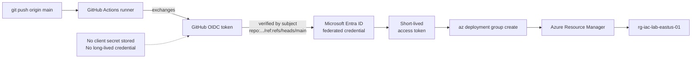

# Module 09 — Infrastructure as code and automation

The automation plane of the **Secure Azure Administration Environment**. This module replaces portal-and-CLI provisioning with declarative Bicep modules, deploys those modules through a GitHub Actions pipeline using OIDC federated credentials (no long-lived service principal secrets), and adds an Azure Automation Account with PowerShell runbooks for scheduled VM start/stop and the daily `ExpiryDate` tag cleanup. The Resource Group → Deployments blade is captured to demonstrate the canonical "where did this template come from" lookup path. Every module deployed in earlier sections gains a Bicep-equivalent here.

## What this module demonstrates

| Skill | Where it shows up |
|---|---|
| Bicep module authoring | Reusable modules for VNet, NSG, storage, KV, VM with KV-secret reference |
| Idempotent deployments | What-if dry-run, parameter file environments, redeploy from clean RG |
| GitHub Actions CI/CD | OIDC federated credential — no secrets in repo |
| RG → Deployments blade | Canonical answer for "find the template that deployed this" |
| Automation Account | System-assigned MI, PowerShell runbooks, schedules |
| Scheduled cost optimization | VM auto-shutdown nightly, weekday-only auto-start |
| Tag-driven cleanup | Runbook flagging resources past their `ExpiryDate` |

## Build steps

This module uses **Bicep for infrastructure, GitHub Actions YAML for CI/CD, PowerShell for runbooks**, and **Portal only for capturing the Deployments blade**.

### 1. Initialize the Bicep workspace

```bash
mkdir -p scripts/{modules,parameters}

# scripts/main.bicep — orchestrator
cat > scripts/main.bicep <<'EOF'
targetScope = 'resourceGroup'

@description('Azure region for all resources')
param location string = resourceGroup().location

@description('Required resource tags')
param tags object

module vnet 'modules/vnet.bicep' = {
  name: 'deploy-vnet'
  params: {
    name: 'vnet-iac-demo-lab-eastus-01'
    addressSpace: '10.99.0.0/16'
    subnetName: 'snet-app'
    subnetPrefix: '10.99.1.0/24'
    location: location
    tags: tags
  }
}

module nsg 'modules/nsg.bicep' = {
  name: 'deploy-nsg'
  params: {
    name: 'nsg-iac-demo-lab-eastus-01'
    location: location
    tags: tags
  }
}
EOF
```

A simple module pattern: `main.bicep` orchestrates, individual modules in `scripts/modules/` are reusable. The pattern scales — add a module for storage, KV, VM, and `main.bicep` composes them with parameters.

### 2. Author the VNet module

`scripts/modules/vnet.bicep`:

```bicep
@description('Name of the virtual network')
param name string

@description('CIDR block for the VNet')
param addressSpace string

param subnetName string
param subnetPrefix string
param location string
param tags object

resource vnet 'Microsoft.Network/virtualNetworks@2024-01-01' = {
  name: name
  location: location
  tags: tags
  properties: {
    addressSpace: { addressPrefixes: [addressSpace] }
    subnets: [
      {
        name: subnetName
        properties: { addressPrefix: subnetPrefix }
      }
    ]
  }
}

output id string = vnet.id
output name string = vnet.name
```

API version is fixed (`2024-01-01`) so behavior is stable across Bicep CLI updates. Outputs surface IDs the orchestrator can wire to dependent modules.

### 3. Bicep what-if before deploy

The what-if operation shows the diff before applying. Always run it before a deploy to a non-throwaway environment.

```bash
RG_IAC=rg-iac-lab-eastus-01

az deployment group what-if \
  --resource-group $RG_IAC \
  --template-file scripts/main.bicep \
  --parameters tags='{"Environment":"lab","Module":"09-iac-automation","Owner":"<handle>","CostCenter":"portfolio","ExpiryDate":"2026-12-31"}'
```

The output uses color-coded diff symbols: `+` for create, `-` for delete, `~` for modify, no symbol for unchanged. Capture the what-if output for evidence — running it before the actual deploy is the discipline that keeps surprise deletions out of production.

### 4. Deploy

```bash
az deployment group create \
  --resource-group $RG_IAC \
  --template-file scripts/main.bicep \
  --parameters tags='{"Environment":"lab","Module":"09-iac-automation","Owner":"<handle>","CostCenter":"portfolio","ExpiryDate":"2026-12-31"}' \
  --name "deploy-main-$(date +%Y%m%d-%H%M%S)"
```

### 5. The Deployments blade

Portal navigation: Resource Group → Deployments. The blade lists every ARM/Bicep deployment to that RG with the template, parameters, and outputs each captured.

This is where "find the template that deployed this resource" gets answered. Junior operators often look at the resource itself; the resource doesn't carry its template — the resource group's Deployments blade does. Capture a deployment, click into it, and screenshot the template view. This screenshot is the most-asked-about evidence in interviews because it proves the candidate knows where to look.

### 6. Tear down and redeploy from clean state

The idempotency test: delete the entire deployed RG, then redeploy from the same Bicep. If the result matches, the IaC is real.

```bash
# Tear down
az group delete -n $RG_IAC --yes

# Recreate the RG (the Bicep targets RG scope, not subscription scope)
az group create -n $RG_IAC --location eastus --tags $TAGS

# Redeploy
az deployment group create \
  --resource-group $RG_IAC \
  --template-file scripts/main.bicep \
  --parameters tags='{...}' \
  --name "redeploy-from-clean"

# Verify the resources match
az resource list -g $RG_IAC -o table
```

Capture the before-and-after; the deployment timestamps differ, but every resource name, configuration, and dependency matches.

### 7. GitHub Actions with OIDC federated credentials

OIDC is the modern path: no service principal secret stored in GitHub Secrets. Instead, GitHub Actions exchanges its OIDC token with Microsoft Entra ID for a short-lived access token at runtime.

**App registration setup** (one-time):

```bash
# Create the app registration
APP_ID=$(az ad app create --display-name "github-portfolio-deploy" --query appId -o tsv)
az ad sp create --id $APP_ID

SUB_ID=$(az account show --query id -o tsv)
SP_OBJECT_ID=$(az ad sp show --id $APP_ID --query id -o tsv)

# Grant Contributor on rg-iac-lab-eastus-01 (least privilege for this lab)
az role assignment create \
  --assignee-object-id $SP_OBJECT_ID \
  --assignee-principal-type ServicePrincipal \
  --role Contributor \
  --scope "/subscriptions/$SUB_ID/resourceGroups/$RG_IAC"

# Add the federated credential — main branch only
az ad app federated-credential create \
  --id $APP_ID \
  --parameters '{
    "name": "github-main",
    "issuer": "https://token.actions.githubusercontent.com",
    "subject": "repo:<your-handle>/secure-azure-operations-portfolio:ref:refs/heads/main",
    "audiences": ["api://AzureADTokenExchange"]
  }'
```

The `subject` field in the federated credential is the security boundary. The federation only succeeds when the workflow runs from `main` of the named repo. Pull requests from forks cannot impersonate this credential because the OIDC token's `sub` claim is set by GitHub, not by the workflow author.

### 8. The deploy workflow

`.github/workflows/deploy-iac.yml`:

```yaml
name: Deploy IaC
on:
  push:
    branches: [main]
    paths: ['09-iac-automation/scripts/**']
  workflow_dispatch:

permissions:
  id-token: write    # required for OIDC
  contents: read

jobs:
  deploy:
    runs-on: ubuntu-latest
    environment: production
    steps:
      - uses: actions/checkout@v4

      - name: Az login (OIDC)
        uses: azure/login@v2
        with:
          client-id: ${{ vars.AZURE_CLIENT_ID }}
          tenant-id: ${{ vars.AZURE_TENANT_ID }}
          subscription-id: ${{ vars.AZURE_SUBSCRIPTION_ID }}

      - name: What-if
        run: |
          az deployment group what-if \
            --resource-group rg-iac-lab-eastus-01 \
            --template-file 09-iac-automation/scripts/main.bicep \
            --parameters @09-iac-automation/scripts/parameters/lab.json

      - name: Deploy
        run: |
          az deployment group create \
            --resource-group rg-iac-lab-eastus-01 \
            --template-file 09-iac-automation/scripts/main.bicep \
            --parameters @09-iac-automation/scripts/parameters/lab.json \
            --name "ci-${{ github.run_id }}"
```

Set `AZURE_CLIENT_ID`, `AZURE_TENANT_ID`, `AZURE_SUBSCRIPTION_ID` as **repository variables** (not secrets — they are not sensitive on their own; the federation subject controls who can use them). Trigger by pushing to main or via Actions → Run workflow.

Capture the successful workflow run as evidence.

### 9. Author ADR-0014 and ADR-0015

`docs/decisions/ADR-0014-bicep-over-arm-json.md` records the decision to author infrastructure in Bicep rather than ARM JSON: terser syntax, modular by default, type-checked, transpiles to ARM at deploy time, no functional gap.

`docs/decisions/ADR-0015-oidc-over-secrets.md` records the decision to use OIDC federated credentials rather than client-secret service principals: no secret to rotate, no secret to leak, scoped to specific repository and branch.

### 10. Azure Automation Account

```bash
RG_P=rg-platform-lab-eastus-01

az automation account create \
  --resource-group $RG_P \
  --name aa-portfolio-lab-eus-01 \
  --location $LOC \
  --sku Basic \
  --tags $TAGS

# Enable system-assigned MI
az automation account update \
  --resource-group $RG_P \
  --automation-account-name aa-portfolio-lab-eus-01 \
  --identity-type SystemAssigned

AA_MI=$(az resource show \
  -g $RG_P -n aa-portfolio-lab-eus-01 \
  --resource-type Microsoft.Automation/automationAccounts \
  --query identity.principalId -o tsv)

# Grant the Automation MI the roles needed by its runbooks
SUB_ID=$(az account show --query id -o tsv)
az role assignment create \
  --assignee-object-id $AA_MI \
  --assignee-principal-type ServicePrincipal \
  --role "Virtual Machine Contributor" \
  --scope "/subscriptions/$SUB_ID"
az role assignment create \
  --assignee-object-id $AA_MI \
  --assignee-principal-type ServicePrincipal \
  --role "Reader" \
  --scope "/subscriptions/$SUB_ID"
```

The Basic SKU includes 500 minutes/month of process automation, which is enough for the lab's two scheduled runbooks. The system-assigned MI replaces the older Run-As Account pattern (which stored a certificate in the automation account) — Run-As Accounts are deprecated and not used here.

### 11. Runbook — VM auto-shutdown nightly

`scripts/runbook-vm-schedule.ps1`:

```powershell
# Stops all lab VMs every night at 19:00 local; resumes weekday mornings.
[CmdletBinding()]
param([Parameter(Mandatory)][ValidateSet('Stop','Start')] [string]$Action)

Connect-AzAccount -Identity | Out-Null

# Find lab VMs by tag
$vms = Get-AzVM | Where-Object { $_.Tags.Environment -eq 'lab' }

foreach ($vm in $vms) {
    Write-Output "$Action $($vm.Name) in $($vm.ResourceGroupName)"
    if ($Action -eq 'Stop') {
        Stop-AzVM -ResourceGroupName $vm.ResourceGroupName -Name $vm.Name -Force
    } else {
        Start-AzVM -ResourceGroupName $vm.ResourceGroupName -Name $vm.Name
    }
}
```

Import as a runbook of type PowerShell:

```bash
# Import via az CLI
az automation runbook create \
  -g $RG_P --automation-account-name aa-portfolio-lab-eus-01 \
  --name rb-vm-schedule --type PowerShell --runbook-content @scripts/runbook-vm-schedule.ps1

az automation runbook publish \
  -g $RG_P --automation-account-name aa-portfolio-lab-eus-01 --name rb-vm-schedule
```

Create two schedules — `sched-stop-19` (daily at 19:00) and `sched-start-08-weekdays` (Mon-Fri at 08:00). Link each schedule to the runbook with the appropriate `-Action` parameter. The cost saving is roughly 70% on a 24×7 baseline, which is the main reason cloud labs survive student-budget environments.

### 12. Runbook — ExpiryDate tag cleanup

`scripts/runbook-expiry-cleanup.ps1`:

```powershell
[CmdletBinding()] param()

Connect-AzAccount -Identity | Out-Null
$today = (Get-Date).ToString('yyyy-MM-dd')

$expired = Get-AzResource | Where-Object {
    $_.Tags -and $_.Tags['ExpiryDate'] -and $_.Tags['ExpiryDate'] -lt $today
}

if ($expired) {
    Write-Warning "Resources past ExpiryDate ($today):"
    $expired | Select-Object Name, ResourceType, ResourceGroupName, @{n='ExpiryDate';e={$_.Tags['ExpiryDate']}} |
        Format-Table | Out-String | Write-Output
} else {
    Write-Output "No resources past ExpiryDate as of $today."
}
```

Schedule daily at 09:00. The runbook does not delete; it reports. Auto-deletion based on tags is a recipe for accidentally destroying production resources that drifted past expiry, so the safe pattern is alert-and-review, not delete.

### 13. Logic App alternative (design only)

For event-driven automation that requires connectors to other services (Slack, Teams, ServiceNow), Logic Apps are the right tool. `docs/logic-app-design.md` documents an Activity Log-triggered Logic App that posts a Slack message when a high-cost resource is created. Not deployed in the lab — Logic App consumption is per-action and the lab does not have a real Slack channel to target.

## Validation

- `az deployment group what-if` returns a non-empty diff against an empty RG and an empty diff against the same RG already deployed (idempotency proof).
- The GitHub Actions workflow run completes successfully with both what-if and deploy steps green.
- The Deployments blade shows the deployment with its template, parameters, and outputs viewable.
- `az automation runbook show` returns the published state for both runbooks.
- Manually triggering `rb-vm-schedule` with `-Action Stop` deallocates the lab VMs.
- The `rb-expiry-cleanup` runbook runs without errors against the lab subscription.

## Cleanup

The Bicep modules, GitHub Actions workflow, automation account, and runbooks are part of the sustained baseline (free or near-free). Keep them; they are the operational ongoing infrastructure.

The `rg-iac-lab-eastus-01` resource group's contents (the demo VNet/NSG deployed as IaC validation) can be torn down once the deployments blade screenshot is captured:

```bash
az group delete -n rg-iac-lab-eastus-01 --yes --no-wait
# Recreate the empty RG so subsequent deploys have a target
az group create -n rg-iac-lab-eastus-01 --location eastus --tags $TAGS
```

**Cost:** $0 spent on this module in incremental terms (Automation 500 min/month is free, GitHub Actions free for public repos, Bicep deployments are free at the IaC level — only the resources they create cost money). Sustained add: $0/month.

## Evidence

| File | Demonstrates |
|---|---|
| `screenshots/09-bicep-what-if.png` | What-if diff output before deploy |
| `screenshots/09-deployment-success.png` | Successful deployment in the Activity Log |
| `screenshots/09-rg-deployments-blade.png` | Resource Group → Deployments showing template history |
| `screenshots/09-deployment-template-view.png` | Template view of a deployment |
| `screenshots/09-redeploy-from-clean.png` | RG deleted, recreated, redeployed — same resources |
| `screenshots/09-app-registration.png` | App registration with federated credential configured |
| `screenshots/09-federated-credential.png` | Federated credential subject scoped to repo and branch |
| `screenshots/09-gh-actions-success.png` | GitHub Actions workflow run completed |
| `screenshots/09-aa-mi-enabled.png` | Automation Account with system-assigned MI |
| `screenshots/09-runbook-published.png` | Runbook in published state |
| `screenshots/09-schedule-stop-19.png` | Stop schedule daily at 19:00 |
| `screenshots/09-schedule-start-weekdays.png` | Start schedule weekdays 08:00 |
| `screenshots/09-runbook-job-output.png` | Runbook job log output |
| `screenshots/09-expiry-cleanup-output.png` | Expiry cleanup runbook output |
| `scripts/main.bicep` | Top-level orchestrator |
| `scripts/modules/vnet.bicep` | Reusable VNet module |
| `scripts/modules/nsg.bicep` | Reusable NSG module |
| `scripts/modules/storage.bicep` | Reusable storage module |
| `scripts/modules/keyvault.bicep` | Reusable KV module |
| `scripts/modules/vm-with-kv-secret.bicep` | VM consuming KV secret via getSecret() |
| `scripts/parameters/lab.json` | Parameter file for lab environment |
| `scripts/parameters/dev.json` | Parameter file for dev environment |
| `scripts/runbook-vm-schedule.ps1` | VM start/stop runbook |
| `scripts/runbook-expiry-cleanup.ps1` | ExpiryDate tag cleanup runbook |
| `scripts/cleanup-orphans.sh` | Orphan resource audit script |
| `.github/workflows/deploy-iac.yml` | OIDC-authenticated deploy workflow |
| `.github/workflows/destroy.yml` | Workflow for tagged resource teardown |
| `diagrams/09-cicd-flow.mmd` | GitHub Actions → OIDC → Az CLI → ARM deployment flow |
| `diagrams/09-bicep-module-graph.mmd` | Bicep modules and their dependencies |
| `docs/decisions/ADR-0014-bicep-over-arm-json.md` | Decision: Bicep |
| `docs/decisions/ADR-0015-oidc-over-secrets.md` | Decision: OIDC federation |
| `docs/logic-app-design.md` | Logic App alternative for event-driven automation |

### Mermaid diagram embedded — CI/CD flow with OIDC



## Resume bullets

- Authored a complete Bicep module library (VNet, NSG, storage, Key Vault, VM-with-KV-secret-reference) with parameter files for multiple environments, deployed via `az deployment group create` and validated for idempotency by RG-delete-and-redeploy cycles.
- Built a GitHub Actions CI/CD pipeline using OIDC federated credentials, eliminating long-lived service principal secrets from the repository while scoping the credential to a specific repo and branch via the federation subject.
- Operationalized a daily what-if dry-run pattern in the deploy workflow, surfacing infrastructure diffs before applying changes — making the deploy step a no-surprise application of an already-reviewed plan.
- Implemented an Azure Automation Account with system-assigned Managed Identity (replacing the deprecated Run-As Account pattern) running PowerShell runbooks for scheduled VM start/stop and daily ExpiryDate-based tag governance reporting, achieving roughly 70% compute cost reduction compared to a 24×7 baseline.
- Captured the Resource Group → Deployments blade workflow as the canonical path for "find the template that deployed this resource," documented in module evidence and reinforced in the design of a multi-environment parameter pattern.

## Interview story

The story is *the OIDC federated credential subject string*. When asked "How do your CI/CD pipelines authenticate to Azure?" the wrong answer is "we have a service principal secret in GitHub Secrets that we rotate every 90 days." The right answer is "GitHub Actions presents an OIDC token at the start of each run. Microsoft Entra ID is configured with a federated credential whose subject string is `repo:<org>/<repo>:ref:refs/heads/main`. The token is validated against that subject — only a workflow running on the main branch of that specific repo can complete the federation. Pull requests from forks cannot impersonate the credential because GitHub itself populates the `sub` claim. There is no secret to rotate, no secret to leak, no secret to copy across environments. The federation is the credential." This module captures every step of that setup — the app registration, the federated credential, the workflow YAML with `permissions: id-token: write`, the successful workflow run with no `client-secret` in the login step. The deeper point is the same as managed identities in module 08: eliminate the credential by construction. When the credential does not exist, the threat model around credential leak goes to zero.
