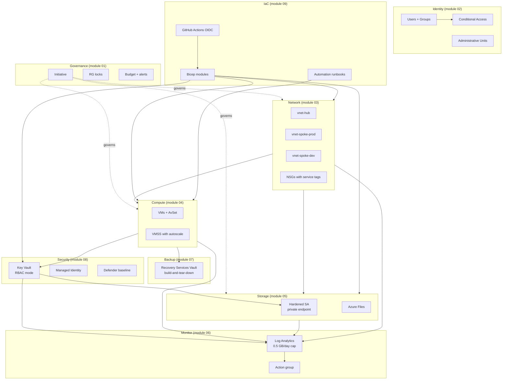

# Module 10 — Final capstone

The integration and validation phase of the **Secure Azure Administration Environment**. This module proves the modules work together, runs five intentional troubleshooting drills under real fault conditions, performs an end-to-end redeployment from clean state to demonstrate full reproducibility, and rolls up the cost actuals against the $100/month budget. The capstone README is the document a hiring manager reads if they only read one — it must summarize the entire portfolio with verifiable evidence in two minutes.

## What this module demonstrates

| Skill | Where it shows up |
|---|---|
| End-to-end integration | Resources from all modules referenced and verified together |
| Troubleshooting under fault conditions | Five intentional-break drills with diagnosis and resolution captured |
| Reproducibility | One module rebuilt from clean state via Bicep CI/CD pipeline |
| Cost discipline outcome | Actuals vs $100/month budget for every month of the build |
| Operational maturity | Decision records cross-linked, ADR index complete, all evidence indexed |

## Build steps

This module uses **all four methods previously chosen** — CLI for verification commands, Portal for visualization, Bicep for redeployment, KQL for diagnostic queries.

### 1. Cross-module integration verification

Confirm that the resources from each module reference each other as designed:

```bash
# Identity → RBAC → Networking
# A test user with User Access Administrator scoped to a VNet (from module 02) 
# can grant Reader on that specific VNet (resource from module 03)

# Networking → Compute
# A VM in vnet-spoke-prod (module 03) with a service-tag NSG rule allowing AzureKeyVault egress

# Compute → Security
# That VM has a system-assigned Managed Identity (module 08)
# granted Key Vault Secrets User on kv-portfolio-lab-eus-XX

# Security → Storage
# The storage account from module 05 uses a customer-managed key (module 08) 
# stored in Key Vault, with automatic key rotation enabled

# Monitoring observes everything
# Log Analytics workspace (module 06) receives diagnostics from KV, storage, NSGs, VMs, Activity Log
```

Capture this verification in a Mermaid diagram showing the actual dependency graph after deployment.

### 2. Five troubleshooting drills

Each drill follows the same pattern: break something on purpose, capture the failure, diagnose using the right tool, fix, capture the success.

#### Drill 1 — Broken peering

**Break:** Disable `useRemoteGateways` on the spoke side of the prod peering.

**Symptom:** Spoke-prod VMs cannot reach a hypothetical hub-deployed VPN gateway. The spoke can reach hub VMs directly via VNet access, but not through the gateway.

**Diagnose:** Network Watcher → Connection Troubleshoot from a spoke VM to a destination beyond the gateway. The diagnostic surfaces the missing transit configuration.

**Fix:** Re-enable `useRemoteGateways` on the spoke peering. Wait for the peering state to return to `Connected`.

**Evidence:** `screenshots/10-drill1-peering-broken.png`, `screenshots/10-drill1-network-watcher-diag.png`, `screenshots/10-drill1-peering-fixed.png`.

#### Drill 2 — NSG denies legitimate traffic

**Break:** Add an inbound NSG rule with priority 90 (higher than the allow-https rule at priority 100) denying all TCP from Internet.

**Symptom:** A web server hosted on a VM behind the NSG stops responding to HTTPS.

**Diagnose:** Network Watcher → IP Flow Verify from Internet source IP, destination port 443. The output names the denying rule explicitly. Or, query NSG flow logs in Log Analytics:

```kusto
AzureNetworkAnalytics_CL
| where SubType_s == "FlowLog"
| where FlowStatus_s == "D"  // Denied
| where DestPort_d == 443
| project TimeGenerated, NSGRule_s, SrcIP_s, DestIP_s, FlowStatus_s
```

**Fix:** Delete the rogue rule, or move its priority above the allow rule, or change its action to Allow.

**Evidence:** `screenshots/10-drill2-https-fails.png`, `screenshots/10-drill2-ip-flow-deny-rule.png`, `screenshots/10-drill2-flow-logs-kql.png`, `screenshots/10-drill2-https-restored.png`.

#### Drill 3 — RBAC failure under Contributor

**Break:** Sign in as a test user holding only `Contributor` on a resource group. Attempt to assign a role to another user.

**Symptom:** `AuthorizationFailed` error referencing the missing `Microsoft.Authorization/roleAssignments/write` permission.

**Diagnose:** Run `az role assignment list --assignee $TEST_USER --all -o table` to confirm the role inventory does not include any role with role-assignment-write permission.

**Fix:** Grant `User Access Administrator` scoped to the specific resource where the user needs to delegate, **not** subscription-wide and **not** Owner.

**Evidence:** `screenshots/10-drill3-contributor-fails.png`, `screenshots/10-drill3-role-list.png`, `screenshots/10-drill3-uaa-narrowly-scoped.png`, `screenshots/10-drill3-assign-succeeds.png`.

#### Drill 4 — Backup restore to wrong location

**Break:** Initiate a full-VM restore from the Recovery Services Vault to a quarantine RG. After restore completes, realize the VM should have landed in `rg-compute` not `rg-backup` (wrong target chosen in the wizard).

**Symptom:** The restored VM exists, but in the wrong RG for the standard naming/governance pattern.

**Diagnose:** Inspect the VM's resource group via `az vm show -d --query resourceGroup`. Confirm the restored VM's location does not match the standard.

**Fix:** Use `az resource move` to relocate the VM, its NIC, its OS disk, and its data disks to the correct RG in a single move operation. All dependent resources must be moved together — a partial move fails.

```bash
# All resources move together
RESOURCES=$(az resource list -g rg-backup-lab-eastus-01 --query "[?contains(name,'vm-restored')].id" -o tsv | tr '\n' ' ')
az resource move --destination-group rg-compute-lab-eastus-01 --ids $RESOURCES
```

**Evidence:** `screenshots/10-drill4-vm-in-wrong-rg.png`, `screenshots/10-drill4-resource-move-success.png`, `screenshots/10-drill4-vm-in-correct-rg.png`.

#### Drill 5 — KQL alert false positive

**Break:** The `kv-unknown-caller` alert from module 08 fires every 15 minutes because the GitHub Actions deployment service principal accesses the Key Vault but is not in the known-principals list.

**Symptom:** Alert email floods inbox with false positives.

**Diagnose:** Look at the alert payload — the firing identity is the `github-portfolio-deploy` service principal from module 09, which is legitimate but was added after the KQL function was first authored.

**Fix:** Update the saved function `kv_unknown_caller_query` to include the deployment service principal's object ID in the known-principals list. Re-evaluate the alert; confirm next evaluation does not fire.

**Evidence:** `screenshots/10-drill5-alert-flooding.png`, `screenshots/10-drill5-known-principals-updated.png`, `screenshots/10-drill5-alert-quiet.png`.

### 3. End-to-end redeployment

The reproducibility test: take one whole module's worth of infrastructure, destroy it, redeploy it from Bicep, and verify the result matches.

```bash
# Capture the current state of rg-iac-lab as baseline
az resource list -g rg-iac-lab-eastus-01 -o json > /tmp/baseline.json

# Destroy
az group delete -n rg-iac-lab-eastus-01 --yes

# Recreate the empty group, then trigger the GitHub Actions workflow
az group create -n rg-iac-lab-eastus-01 --location eastus --tags $TAGS
gh workflow run deploy-iac.yml

# Wait for the workflow to complete
gh run watch

# Compare
az resource list -g rg-iac-lab-eastus-01 -o json > /tmp/redeployed.json
diff <(jq -S 'sort_by(.name) | map(.name + " " + .type)' /tmp/baseline.json) \
     <(jq -S 'sort_by(.name) | map(.name + " " + .type)' /tmp/redeployed.json)
```

The diff should be empty — same resource names, same types. Capture the workflow run, the diff output (empty, or showing only timestamps and IDs which legitimately differ), and the resource list of the redeployed state.

### 4. Cost actuals roll-up

For each completed month, capture:

| Month | Sustained baseline | Within-session bursts | Total | Budget | Variance |
|---|---|---|---|---|---|
| Month 1 | $4 | $8 (Bastion, JIT, ILB) | $12 | $100 | -$88 |
| Month 2 | $5 | $6 | $11 | $100 | -$89 |
| Month 3 | $5 | $11 (RSV restore drill) | $16 | $100 | -$84 |

The discipline shows in the variance column. Spending is intentional, capped, and reported. Capture the Cost Analysis charts grouped by Module tag for each month.

### 5. Final orphan-resource audit

Run the orphan-audit script from `09-iac-automation/scripts/cleanup-orphans.sh`. Resolve any orphans (delete or extend `ExpiryDate`). The expectation at end-of-portfolio is zero orphans.

```bash
bash scripts/cleanup-orphans.sh
# Expect: empty result tables across all four checks
```

### 6. Capstone documentation

The capstone narrative pulls together:

- Architecture overview with the master Mermaid diagram showing every module's primary resources and their relationships.
- Module index linking each module's README.
- Lessons learned — five short paragraphs covering RBAC scope discipline, the build-then-tear-down pattern, the centralized Log Analytics workspace, the OIDC federated credential design, and the restore drill discipline.
- Skills demonstrated — table mapping skills to evidence files.
- Decisions index — links to all 15 ADRs.
- Future work — what would be added with more time or budget (Front Door, Sentinel deployment, full ASR replication, Application Gateway WAF deployment, multi-region active-active).

## Validation

- Cross-module integration diagram matches the actual deployed dependency graph.
- All five drills have before/diagnose/fix/after evidence captured.
- The redeployment diff against baseline is empty for resource identity (timestamps and unique IDs naturally differ).
- The orphan audit script returns empty result tables.
- Cost actuals for the period stay below the $100/month budget cap with all months accounted for.

## Cleanup

This module's "cleanup" is the end-of-portfolio teardown sequence. The decision to tear down or keep the lab is a personal trade-off — keeping it costs ~$5–10/month sustained; tearing it down requires the [`../cost-and-cleanup.md`](../cost-and-cleanup.md) end-of-portfolio sequence.

If you continue extending the portfolio (recommended for the IAM/security track — module 08 is the foundation for AZ-500 work), keep the sustained baseline and skip the teardown.

**Cost:** $0 incremental for this module beyond the drill costs already counted in earlier modules.

## Evidence

| File | Demonstrates |
|---|---|
| `screenshots/10-cross-module-integration.png` | Verification commands showing module dependencies satisfied |
| `screenshots/10-drill1-peering-broken.png` through `10-drill1-peering-fixed.png` | Peering drill — break, diagnose, fix |
| `screenshots/10-drill2-https-fails.png` through `10-drill2-https-restored.png` | NSG drill — break, diagnose with IP Flow Verify and KQL, fix |
| `screenshots/10-drill3-contributor-fails.png` through `10-drill3-assign-succeeds.png` | RBAC drill — Contributor fails, UAA narrowly scoped, succeeds |
| `screenshots/10-drill4-vm-in-wrong-rg.png` through `10-drill4-vm-in-correct-rg.png` | Move drill — wrong target, resource move, correct landing |
| `screenshots/10-drill5-alert-flooding.png` through `10-drill5-alert-quiet.png` | Alert tuning drill |
| `screenshots/10-redeploy-workflow-success.png` | GitHub Actions redeploy run completed |
| `screenshots/10-redeploy-diff-empty.png` | Diff of baseline vs redeployed resources empty |
| `screenshots/10-cost-actuals-by-month.png` | Cost Analysis chart of monthly spend by Module tag |
| `screenshots/10-final-orphan-audit-clean.png` | Orphan audit script returning empty tables |
| `diagrams/10-final-architecture.mmd` | Master architecture with all modules' resources |
| `diagrams/10-cross-module-dependencies.mmd` | Inter-module dependency graph |
| `docs/lessons-learned.md` | Five-paragraph reflection on what the portfolio taught |
| `docs/skills-demonstrated.md` | Skills-to-evidence mapping |
| `docs/future-work.md` | What would be added with more time or budget |

### Mermaid diagram embedded — final architecture



## Resume bullets

- Operated five intentional troubleshooting drills end-to-end (peering misconfiguration, NSG rule conflict, RBAC permission gap, backup-restore wrong-target, monitoring alert tuning) with documented diagnose-fix evidence proving operational readiness under fault conditions.
- Performed an end-to-end infrastructure redeployment from a destroyed resource group, validated by an empty diff against the pre-destruction baseline, demonstrating Bicep IaC reproducibility and CI/CD pipeline reliability.
- Maintained sustained Azure spend below $20/month against a $100/month budget across the project lifetime, with cost actuals captured monthly and grouped by the `Module` tag for per-area attribution.
- Authored a 15-entry Architecture Decision Record series capturing rationale for hub-and-spoke topology, RBAC mode for Key Vault, OIDC federation over service principal secrets, customer-managed encryption keys, soft-delete trade-offs, and other consequential design choices.
- Delivered eleven module READMEs with copy-ready explanations, deployable code, validation commands, exact evidence filenames, cost guards, resume bullets, and interview stories — designed to function as employer-facing portfolio proof rather than personal study notes.

## Interview story

The story is the *empty diff*. Most cloud lab portfolios show a deployed resource and a screenshot. The capstone shows a deployed resource, a screenshot, the resource group destroyed, and the same resource redeployed from the same Bicep template with an empty diff against the original — including the same name, the same configuration, the same dependency graph. That single comparison is the cleanest possible demonstration of infrastructure-as-code maturity. The interviewer who asks "How do you know your IaC works?" is looking for an answer that isn't faith. The empty diff is not faith. The deeper point is what the discipline costs and what it returns: writing Bicep modules takes longer initially than clicking through the portal, but the payoff is the redeploy. When a region fails, when a subscription needs to be cloned, when a junior engineer accidentally deletes the wrong RG, the redeploy is the recovery. That value is invisible until the day it is needed, and on that day it is the entire job.
