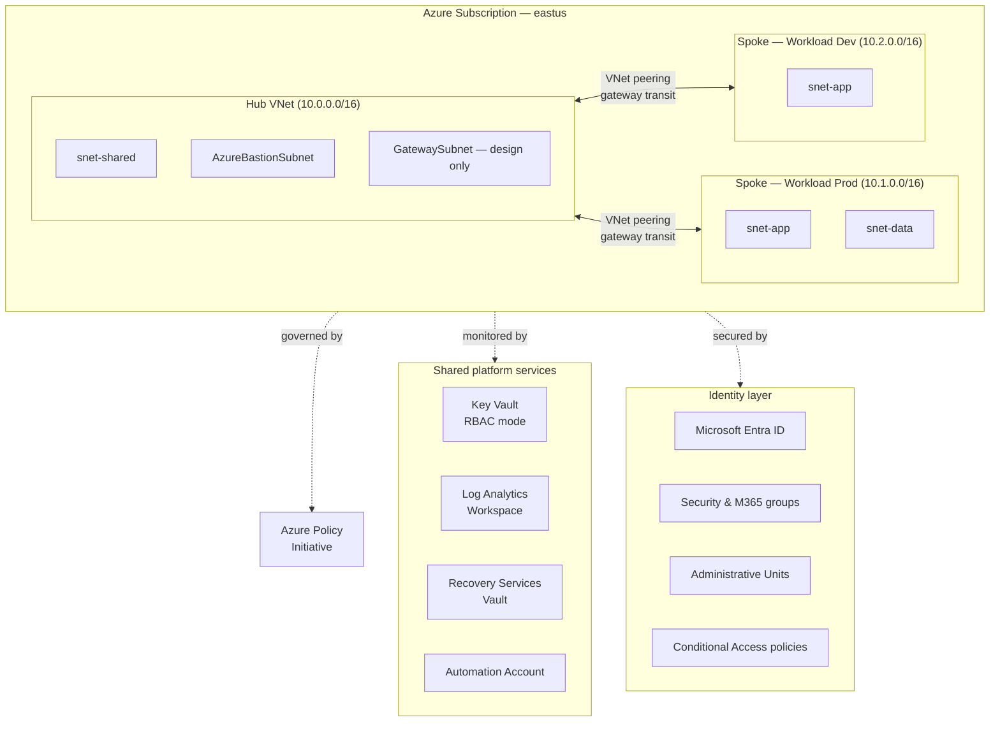

# Secure Azure Operations Portfolio

A hands-on, production-style Azure environment built and operated by a single engineer to demonstrate cloud operations, identity, networking, monitoring, backup, security, and infrastructure-as-code skills. Every module ships with deployable code, screenshots of working configurations, validation evidence, and an architecture decision record.

The deployed environment is named the **Secure Azure Administration Environment** — a hub-and-spoke topology centralizing identity, monitoring, and shared services, with workload spokes for compute and data.

## Why this exists

Most cloud portfolios show toy labs in isolation: one VM here, one storage account there, no story. This portfolio is structured the way a small platform team would actually run an Azure subscription — central governance, tagged resources, role-based access, monitored workloads, automated deployments, and a tested recovery path. Each of the eleven modules is independently runnable but designed to plug into the others.

## Architecture



## Module index

| # | Module | Focus |
|---|---|---|
| 00 | Project overview | Repo, tooling, naming, tagging baseline |
| 01 | Governance and cost | Tags, policies, locks, budgets, Advisor, initiatives |
| 02 | Identity and RBAC | Users, groups, custom roles, AUs, Conditional Access, hybrid identity design |
| 03 | Networking | Hub-and-spoke peering, NSGs/ASGs, service tags, DNS, load balancers, Network Watcher |
| 04 | Compute | VMs, availability sets, scale sets, disks, images, extensions, JIT |
| 05 | Storage | Accounts, blobs, files (identity auth), lifecycle, private endpoints |
| 06 | Monitoring and logs | Log Analytics, KQL, alerts, action groups, workbooks, dashboards |
| 07 | Backup and recovery | Recovery Services Vault, backup policies, file and full-VM restore drill |
| 08 | Security operations | Key Vault (RBAC), Managed Identity, Defender for Cloud, JIT, secure score |
| 09 | IaC and automation | Bicep modules, GitHub Actions OIDC, Automation Account runbooks |
| 10 | Final capstone | Integration validation, troubleshooting drills, end-to-end redeployment |

Each module folder contains its own `README.md` with explanation, build steps, exact screenshot filenames, validation checks, cleanup commands, resume bullets, and an interview story. Start with [`00-project-overview/README.md`](./00-project-overview/README.md).

## Naming and tagging

Resources follow a strict convention so cost reports, automation, and audits all work without per-resource tagging exceptions.

```
<type>-<workload>-<env>-<region>-<instance>

Examples:
  rg-network-hub-lab-eastus-01
  vnet-hub-lab-eastus-01
  vm-app-lab-eus-01
  kv-portfolio-lab-eus-01
```

Every resource carries five tags: `Environment`, `Module`, `Owner`, `CostCenter`, `ExpiryDate`. Untagged resources are flagged daily by an Automation runbook. The full standard is in [`architecture.md`](./architecture.md).

## Cost discipline

Sustained baseline runs $5–10/month. Higher-cost services (Bastion, Application Gateway, VPN Gateway, Defender for Servers) are deployed briefly, validated with screenshots, and torn down inside the same session. A monthly budget alerts at 50/80/100% of $100. Daily orphan-resource audits catch unattached disks, idle public IPs, and stranded NICs. Full strategy in [`cost-and-cleanup.md`](./cost-and-cleanup.md).

## Decisions

Architecture decisions are recorded in [`docs/decisions/`](./docs/decisions/). Topics include hub-and-spoke vs flat topology, tags vs separate resource groups for environment slicing, RBAC mode vs access policies for Key Vault, OIDC federated credentials vs service principal secrets, and several others.

## How to use this repo

This is reference material, not a deployable end-to-end product. Each module is self-contained — you can run module 03 (networking) without running module 07 (backup). All scripts are parameterized; no subscription IDs, tenant IDs, or personal identifiers are committed. Replace the `<>` placeholders in any command with your own values.

## License

MIT — see [`LICENSE`](./LICENSE).
